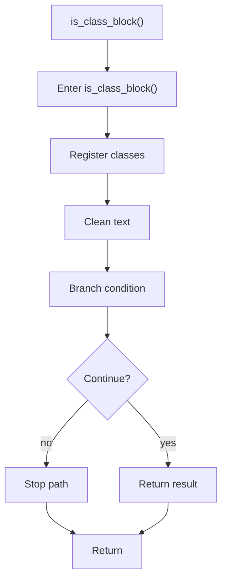

# is_class_block.cpp

- Source document: [behavioural_logic_scaffold.cpp.md](../../behavioural_logic_scaffold.cpp.md)
- Purpose: decoupled implementation logic for a future code unit.

### is_class_block()
This routine owns one focused piece of the file's behavior. It appears near line 98.

Inside the body, it mainly handles inspect or register class-level information, normalize raw text before later parsing, and branch on runtime conditions.

It branches on runtime conditions instead of following one fixed path. The caller receives a computed result or status from this step.

What it does:
- inspect or register class-level information
- normalize raw text before later parsing
- branch on runtime conditions

Flow:

