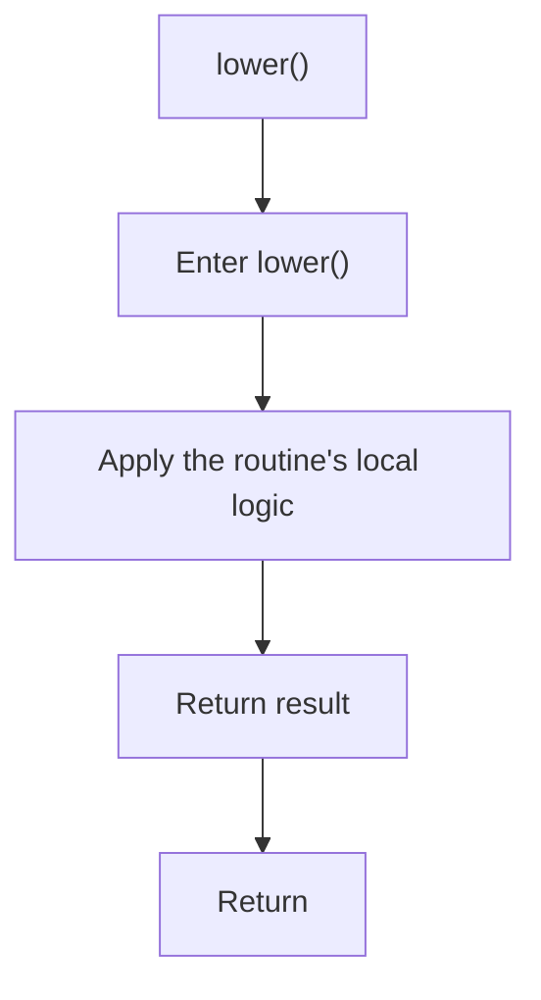

# lower.cpp

- Source document: [behavioural_logic_scaffold.cpp.md](../../behavioural_logic_scaffold.cpp.md)
- Purpose: decoupled implementation logic for a future code unit.

### lower()
This routine owns one focused piece of the file's behavior. It appears near line 29.

The caller receives a computed result or status from this step.

What it does:
- This routine is primarily structural and does not expose obvious runtime operations from static inspection.

Flow:

