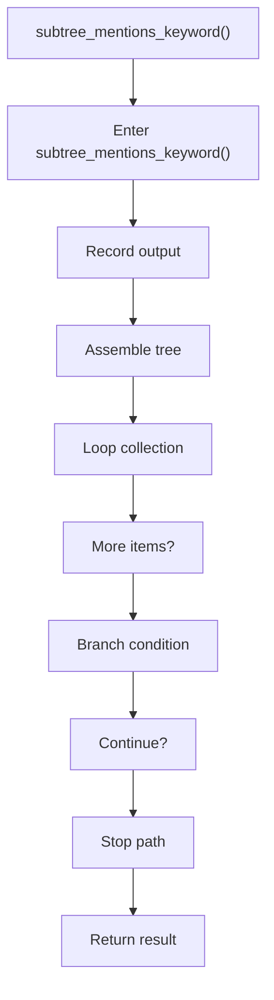
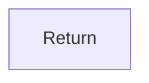

# subtree_mentions_keyword.cpp

- Source document: [behavioural_logic_scaffold.cpp.md](../../behavioural_logic_scaffold.cpp.md)
- Purpose: decoupled implementation logic for a future code unit.

### subtree_mentions_keyword()
This routine owns one focused piece of the file's behavior. It appears near line 159.

Inside the body, it mainly handles record derived output into collections, assemble tree or artifact structures, iterate over the active collection, and branch on runtime conditions.

The implementation iterates over a collection or repeated workload. It branches on runtime conditions instead of following one fixed path. The caller receives a computed result or status from this step.

What it does:
- record derived output into collections
- assemble tree or artifact structures
- iterate over the active collection
- branch on runtime conditions

Flow:

### Block 3 - subtree_mentions_keyword() Details
#### Slice 1 - Opening Intent
Quick summary: This slice shows the opening intent of subtree_mentions_keyword.cpp and the first major actions that frame the rest of the flow.
Why this is separate: subtree_mentions_keyword.cpp has multiple branches, loops, or stage changes, so this section is split out to keep one major intent visible at a time instead of forcing one oversized diagram.

#### Slice 2 - Early Branches
Quick summary: This slice covers the first branch-heavy continuation of subtree_mentions_keyword.cpp after the opening path has been established.
Why this is separate: subtree_mentions_keyword.cpp has multiple branches, loops, or stage changes, so this section is split out to keep one major intent visible at a time instead of forcing one oversized diagram.

