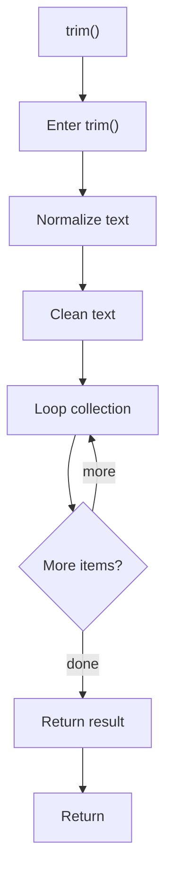

# trim.cpp

- Source document: [behavioural_logic_scaffold.cpp.md](../../behavioural_logic_scaffold.cpp.md)
- Purpose: decoupled implementation logic for a future code unit.

### trim()
This helper reshapes small pieces of data so the surrounding code can stay readable. It appears near line 13.

Inside the body, it mainly handles normalize or format text values, normalize raw text before later parsing, and iterate over the active collection.

The implementation iterates over a collection or repeated workload. The caller receives a computed result or status from this step.

What it does:
- normalize or format text values
- normalize raw text before later parsing
- iterate over the active collection

Flow:

