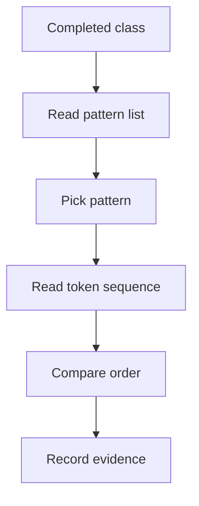

# pattern_catalog.json

- Folder: `docs/Codebase/Microservice/Modules/Source/Analysis/Patterns/Catalog`
- Role: future data file that stores supported design-pattern definitions and ordered token signatures

## Purpose
This file houses the known pattern structures that automatic recognition should check after class declarations are generated. The catalog replaces the old assumption that the user must provide the source design pattern.

The important requirement is that every generic pattern entry carries enough ordered token information for the parser to cross-reference a completed class against the pattern list.
For extensibility, a pattern entry can describe a nested lexeme layout first and let the middleman or a hook verify the deeper cross-pattern rules later.

## Shape
```json
{
  "version": 1,
  "patterns": [
    {
      "id": "creational.builder",
      "family": "creational",
      "name": "Builder",
      "enabled": true,
      "scope": "class",
      "token_sequences": [
        {
          "id": "builder_class_shape",
          "source": "class_declaration",
          "ordered": true,
          "tokens": [
            { "kind": "class_keyword" },
            { "kind": "identifier", "capture": "builder" },
            { "kind": "open_scope" },
            { "kind": "method_return_type", "capture": "return_type" },
            { "kind": "method_name", "capture": "step_method" },
            { "kind": "open_paren" },
            { "kind": "close_paren" },
            { "kind": "return_statement", "optional": true },
            { "kind": "close_scope" }
          ]
        }
      ],
      "roles": [
        { "id": "builder", "kind": "class", "required": true },
        { "id": "step_method", "kind": "method", "minimum": 1 }
      ],
      "relations": [
        { "from": "builder", "to": "step_method", "kind": "owns" }
      ],
      "evidence": [
        { "kind": "method_chain_or_step_sequence", "weight": 1 }
      ]
    }
  ]
}
```

## Required Fields
- `version`: catalog format version.
- `patterns`: array of supported pattern definitions.
- `id`: stable machine-readable pattern key.
- `family`: broad grouping such as `creational`, `behavioural`, or another supported family.
- `enabled`: default participation in automatic recognition.
- `scope`: matching boundary, usually `class` for class-level checks.
- `token_sequences`: ordered lexical or structural tokens that can identify the pattern shape.
- `roles`: structural pieces expected in a candidate.
- `relations`: required relationships between roles.
- `evidence`: evidence hints used by hooks or generic matching.

## Token Sequence Fields
- `id`: stable key for the token sequence inside one pattern.
- `source`: token source such as `class_declaration`, `method_body`, `usage_trace`, or `symbol_table`.
- `ordered`: whether token order is mandatory.
- `tokens`: ordered token matchers.
- `kind`: normalized token name from lexical analysis or structural event generation.
- `capture`: named value captured for later role or relation checks.
- `optional`: token may be absent without rejecting the sequence.
- `repeat`: token or token group may appear more than once.
- `one_of`: acceptable token alternatives for one position.

## Pattern List Cross Reference
Each pattern entry should be treated as a row in the supported pattern list. Recognition walks the list and compares the candidate class token stream against every enabled pattern entry.

If a pattern becomes too complex for a single flat token list, the catalog can express it as a scoped hierarchy of ordered pieces, then leave cross-reference or family hooks to decide whether the candidate belongs in the main tree or a detached virtual branch.



## Initial Catalog Entries
- `creational.singleton`
  - token sequence should look for class declaration, restricted constructor, static instance storage or accessor, and repeated self-type references.
- `creational.factory`
  - token sequence should look for creator function tokens, conditional or mapping tokens, product construction tokens, and product return tokens.
- `creational.builder`
  - token sequence should look for builder class tokens, step method tokens, chained return or accumulated state tokens, and final build method tokens.
- `behavioural.strategy`
  - token sequence should look for interface or base strategy tokens, context-held strategy reference tokens, and delegated call tokens.
- `behavioural.observer`
  - token sequence should look for subject collection tokens, attach or detach method tokens, notify loop tokens, and observer update call tokens.

## Matching Rule
- Every enabled pattern is checked against every completed class declaration unless runtime options explicitly filter it.
- A catalog entry can produce a match when its ordered token sequences and role relations match the candidate.
- If generic rules are not enough, the catalog entry can name a hook that adds pattern-specific evidence.
- The old strict lexeme-by-lexeme check is still valid for small cases, but the catalog should support scoped nested layouts for extensible pattern families.

## Acceptance Checks
- Adding a new structure means adding a new catalog entry first.
- The parser can validate missing fields before recognition starts.
- The catalog carries ordered tokens or token alternatives for parser cross-reference.
- Catalog data can describe expected pattern shape without changing lexical scanning.

## Live Schema (as actually consumed today)
The active catalog at `Codebase/Microservice/pattern_catalog/<family>/<pattern>.json` uses a flatter shape than the conceptual `version 1` schema above. The C++ parser at `pattern_catalog_parser.cpp` reads only `ordered_checks`; unknown top-level fields (`evidence_rules`, `implementation_template`) are silently ignored on the matcher side.

```jsonc
{
  "pattern_id":     "creational.singleton",
  "pattern_family": "creational",
  "pattern_name":   "Singleton",
  "enabled":        true,

  // C++ matcher gate: strict token-sequence "is this class a candidate?"
  "ordered_checks": [
    { "id": "class_introducer",  "expected_kind": "Keyword",     "expected_lexeme_any_of": ["class", "struct"] },
    { "id": "deleted_copy_op",   "expected_kind": "Keyword",     "expected_lexeme_any_of": ["delete"] }
  ],

  // Discretized, language-grounded evidence questions for the ranker.
  // Each rule is a yes/no/count question the parse tree can answer.
  "evidence_rules": [
    { "id": "deleted_copy_ctor",           "kind": "deleted_method",    "method": "copy_ctor",     "polarity": "positive" },
    { "id": "static_local_self_in_method", "kind": "static_local",      "of_type": "{class_name}", "polarity": "positive" },
    { "id": "no_pure_virtual",             "kind": "pure_virtual_count", "max": 0,                 "polarity": "positive" }
  ]
}
```

### Field Roles
| Field | Consumer | Role |
|---|---|---|
| `ordered_checks` | C++ matcher | Strict token-sequence match — all-or-nothing gate. Widening an existing `expected_lexeme_any_of` list is safe; adding one to a step that didn't have it is a tightening change. |
| `expected_lexeme_any_of` | C++ matcher | When present, the token's lexeme MUST be one of these. When absent, any lexeme of the right `expected_kind` matches. |
| `capture_as` | C++ matcher | Records the matched token's lexeme under this name for downstream use. |
| `evidence_rules` | C++ evidence extractor + JS/TS ranker | Discretized predicates. Each `kind` is a question the parse tree can answer deterministically — no regex over identifier text. See D29 in `docs/Codebase/DESIGN_DECISIONS.md` for the full vocabulary. |

### Cross-cutting note
Per `DESIGN_DECISIONS.md` D29, ALL pattern-disambiguation evidence is expressed as discretized `evidence_rules` keyed off language tokens and STL types. Naming heuristics (`class \w*Factory`, `target_`, `(get|Get)Instance`) are explicitly forbidden — they conflate "class is named like a Factory" with "class behaves like a Factory" and produce arbitrary scores that depend on developer style.

The previous regex-based `implementation_template` block was removed in the same change. The Adapter file retains a single residual `implementation_template.expected_collaborators` entry (the adaptee-arg shape) pending its replacement with the equivalent `evidence_rules` entry; once Adapter's `evidence_rules` lands the legacy block will go.
