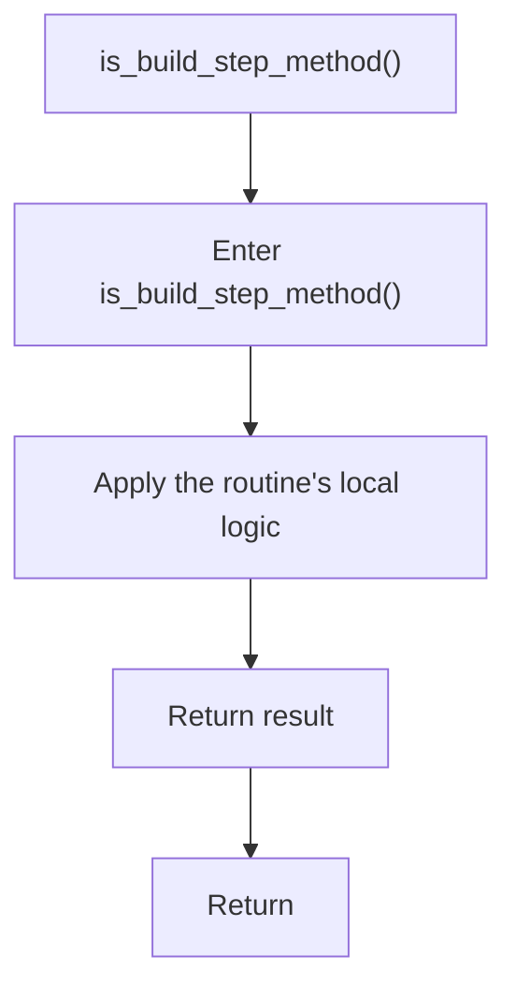

# is_build_step_method.cpp

- Source document: [builder_pattern_logic.cpp.md](../../builder_pattern_logic.cpp.md)
- Purpose: decoupled implementation logic for a future code unit.

### is_build_step_method()
This routine owns one focused piece of the file's behavior. It appears near line 168.

The caller receives a computed result or status from this step.

What it does:
- This routine is primarily structural and does not expose obvious runtime operations from static inspection.

Flow:

