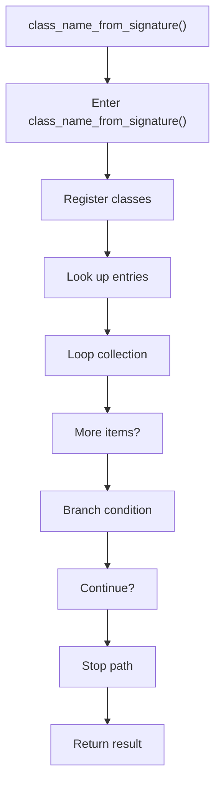
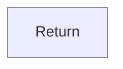

# class_name_from_signature.cpp

- Source document: [factory_pattern_logic.cpp.md](../../factory_pattern_logic.cpp.md)
- Purpose: decoupled implementation logic for a future code unit.

### class_name_from_signature()
This routine owns one focused piece of the file's behavior. It appears near line 65.

Inside the body, it mainly handles inspect or register class-level information, look up entries in previously collected maps or sets, iterate over the active collection, and branch on runtime conditions.

The implementation iterates over a collection or repeated workload. It branches on runtime conditions instead of following one fixed path. The caller receives a computed result or status from this step.

What it does:
- inspect or register class-level information
- look up entries in previously collected maps or sets
- iterate over the active collection
- branch on runtime conditions

Flow:

### Block 3 - class_name_from_signature() Details
#### Slice 1 - Opening Intent
Quick summary: This slice shows the opening intent of class_name_from_signature.cpp and the first major actions that frame the rest of the flow.
Why this is separate: class_name_from_signature.cpp has multiple branches, loops, or stage changes, so this section is split out to keep one major intent visible at a time instead of forcing one oversized diagram.

#### Slice 2 - Early Branches
Quick summary: This slice covers the first branch-heavy continuation of class_name_from_signature.cpp after the opening path has been established.
Why this is separate: class_name_from_signature.cpp has multiple branches, loops, or stage changes, so this section is split out to keep one major intent visible at a time instead of forcing one oversized diagram.

