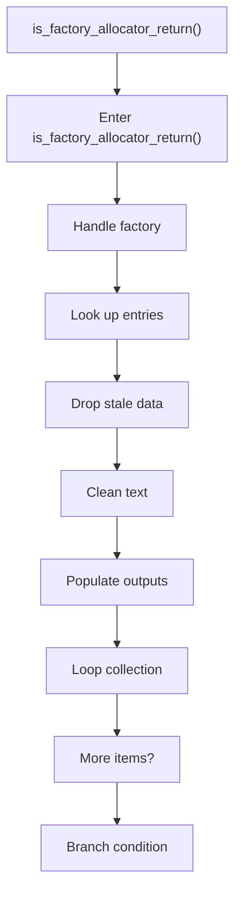
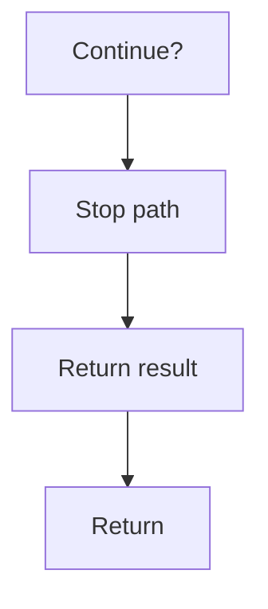

# is_factory_allocator_return.cpp

- Source document: [factory_pattern_logic.cpp.md](../../factory_pattern_logic.cpp.md)
- Purpose: decoupled implementation logic for a future code unit.

### is_factory_allocator_return()
This routine owns one focused piece of the file's behavior. It appears near line 216.

Inside the body, it mainly handles handle factory-specific detection or rewrite logic, look up entries in previously collected maps or sets, drop stale entries or obsolete source fragments, and normalize raw text before later parsing.

The implementation iterates over a collection or repeated workload. It branches on runtime conditions instead of following one fixed path. The caller receives a computed result or status from this step.

What it does:
- handle factory-specific detection or rewrite logic
- look up entries in previously collected maps or sets
- drop stale entries or obsolete source fragments
- normalize raw text before later parsing
- populate output fields or accumulators
- iterate over the active collection
- branch on runtime conditions

Flow:

### Block 5 - is_factory_allocator_return() Details
#### Slice 1 - Opening Intent
Quick summary: This slice shows the opening intent of is_factory_allocator_return.cpp and the first major actions that frame the rest of the flow.
Why this is separate: is_factory_allocator_return.cpp has multiple branches, loops, or stage changes, so this section is split out to keep one major intent visible at a time instead of forcing one oversized diagram.

#### Slice 2 - Early Branches
Quick summary: This slice covers the first branch-heavy continuation of is_factory_allocator_return.cpp after the opening path has been established.
Why this is separate: is_factory_allocator_return.cpp has multiple branches, loops, or stage changes, so this section is split out to keep one major intent visible at a time instead of forcing one oversized diagram.

