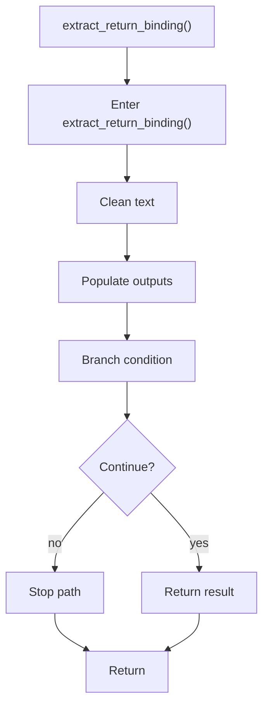

# extract_return_binding.cpp

- Source document: [singleton_pattern_logic.cpp.md](../../singleton_pattern_logic.cpp.md)
- Purpose: decoupled implementation logic for a future code unit.

### extract_return_binding()
This routine owns one focused piece of the file's behavior. It appears near line 241.

Inside the body, it mainly handles normalize raw text before later parsing, populate output fields or accumulators, and branch on runtime conditions.

It branches on runtime conditions instead of following one fixed path. The caller receives a computed result or status from this step.

What it does:
- normalize raw text before later parsing
- populate output fields or accumulators
- branch on runtime conditions

Flow:

