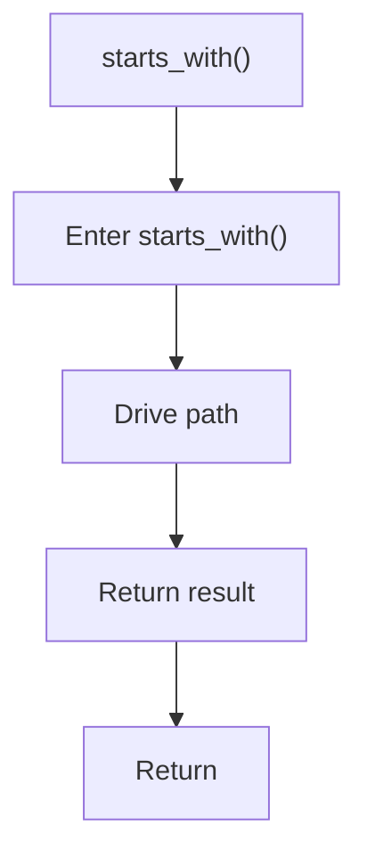

# starts_with.cpp

- Source document: [singleton_pattern_logic.cpp.md](../../singleton_pattern_logic.cpp.md)
- Purpose: decoupled implementation logic for a future code unit.

### starts_with()
This routine prepares or drives one of the main execution paths in the file. It appears near line 34.

Inside the body, it mainly handles drive the main execution path.

The caller receives a computed result or status from this step.

What it does:
- drive the main execution path

Flow:

