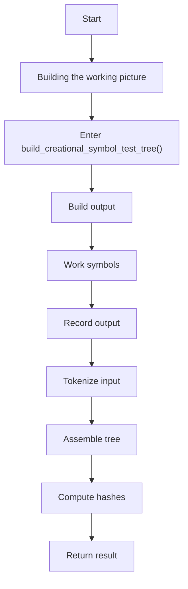
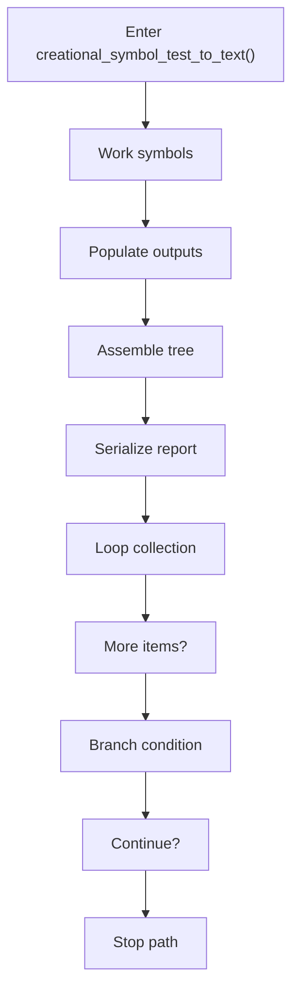
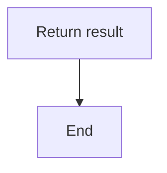
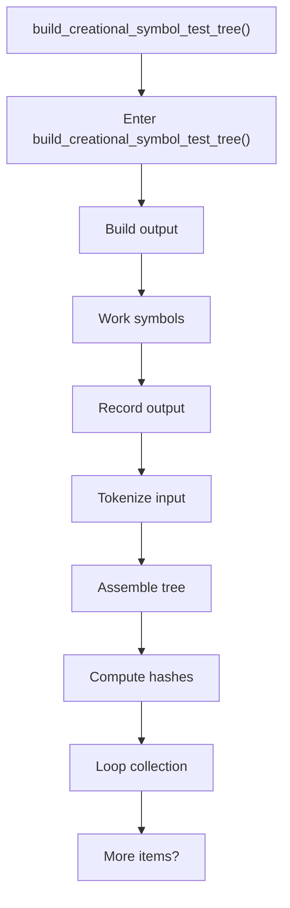
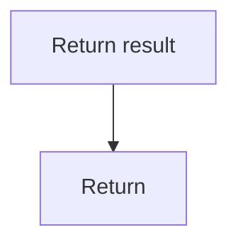
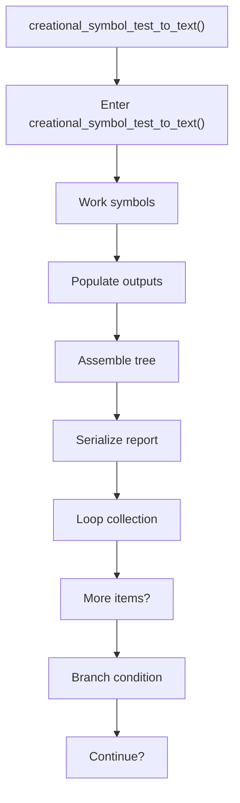
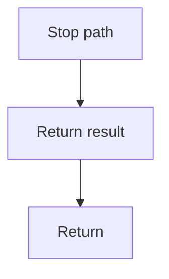

# creational_symbol_test.cpp

- Source: Microservice/Modules/Source/Creational/creational_symbol_test.cpp
- Kind: C++ implementation
- Lines: 55

## Story
### What Happens Here

This source file implements creational-pattern analysis over the generic parse tree. It inspects parsed structure, applies pattern-specific rules, and emits detector results that later appear in the creational tree or documentation tags.

### Why It Matters In The Flow

Runs after the generic parse tree exists so creational detection can label the structure.

### What To Watch While Reading

Implements creational pattern detection over the generic parse tree. The main surface area is easiest to track through symbols such as build_creational_symbol_test_tree, creational_symbol_test_to_text, and std::string. It collaborates directly with creational_symbol_test.hpp, parse_tree_symbols.hpp, functional, and sstream.

## Program Flow
This diagram follows the action path in plain words. Decision diamonds show where the file can stop, branch, or repeat work instead of simply passing through a straight line.

The flow is intentionally split into smaller slices so the major intent of creational_symbol_test.cpp stays readable. Each slice names the stage it is covering, gives a quick summary, and explains why that stage is separated from the next one.

### Program Flow Slices
#### Slice 1 - Opening Intent
Quick summary: This slice shows the opening intent of creational_symbol_test.cpp and the first major actions that frame the rest of the flow.
Why this is separate: creational_symbol_test.cpp has multiple branches, loops, or stage changes, so this section is split out to keep one major intent visible at a time instead of forcing one oversized diagram.

#### Slice 2 - Early Branches
Quick summary: This slice covers the first branch-heavy continuation of creational_symbol_test.cpp after the opening path has been established.
Why this is separate: creational_symbol_test.cpp has multiple branches, loops, or stage changes, so this section is split out to keep one major intent visible at a time instead of forcing one oversized diagram.

#### Slice 3 - Mid-Flow Handoff
Quick summary: This slice captures the mid-flow handoff in creational_symbol_test.cpp where preparation turns into deeper processing.
Why this is separate: creational_symbol_test.cpp has multiple branches, loops, or stage changes, so this section is split out to keep one major intent visible at a time instead of forcing one oversized diagram.

## Reading Map
Read this file as: Implements creational pattern detection over the generic parse tree.

Where it sits in the run: Runs after the generic parse tree exists so creational detection can label the structure.

Names worth recognizing while reading: build_creational_symbol_test_tree, creational_symbol_test_to_text, and std::string.

It leans on nearby contracts or tools such as creational_symbol_test.hpp, parse_tree_symbols.hpp, functional, sstream, and string.

## Story Groups

### Building The Working Picture
These steps assemble the trees, models, or bundles used by the rest of the file.
- build_creational_symbol_test_tree() (line 8): Build or append the next output structure, work with symbol-oriented state, and record derived output into collections
- creational_symbol_test_to_text() (line 33): Work with symbol-oriented state, populate output fields or accumulators, and assemble tree or artifact structures

## Function Stories

### build_creational_symbol_test_tree()
This routine assembles a larger structure from the inputs it receives. It appears near line 8.

Inside the body, it mainly handles build or append the next output structure, work with symbol-oriented state, record derived output into collections, and parse or tokenize input text.

The implementation iterates over a collection or repeated workload. The caller receives a computed result or status from this step.

What it does:
- build or append the next output structure
- work with symbol-oriented state
- record derived output into collections
- parse or tokenize input text
- assemble tree or artifact structures
- compute hash metadata
- iterate over the active collection

Flow:

### Block 2 - build_creational_symbol_test_tree() Details
#### Slice 1 - Opening Intent
Quick summary: This slice shows the opening intent of creational_symbol_test.cpp and the first major actions that frame the rest of the flow.
Why this is separate: creational_symbol_test.cpp has multiple branches, loops, or stage changes, so this section is split out to keep one major intent visible at a time instead of forcing one oversized diagram.

#### Slice 2 - Early Branches
Quick summary: This slice covers the first branch-heavy continuation of creational_symbol_test.cpp after the opening path has been established.
Why this is separate: creational_symbol_test.cpp has multiple branches, loops, or stage changes, so this section is split out to keep one major intent visible at a time instead of forcing one oversized diagram.

### creational_symbol_test_to_text()
This routine owns one focused piece of the file's behavior. It appears near line 33.

Inside the body, it mainly handles work with symbol-oriented state, populate output fields or accumulators, assemble tree or artifact structures, and serialize report content.

The implementation iterates over a collection or repeated workload. It branches on runtime conditions instead of following one fixed path. The caller receives a computed result or status from this step.

What it does:
- work with symbol-oriented state
- populate output fields or accumulators
- assemble tree or artifact structures
- serialize report content
- iterate over the active collection
- branch on runtime conditions

Flow:

### Block 3 - creational_symbol_test_to_text() Details
#### Slice 1 - Opening Intent
Quick summary: This slice shows the opening intent of creational_symbol_test.cpp and the first major actions that frame the rest of the flow.
Why this is separate: creational_symbol_test.cpp has multiple branches, loops, or stage changes, so this section is split out to keep one major intent visible at a time instead of forcing one oversized diagram.

#### Slice 2 - Early Branches
Quick summary: This slice covers the first branch-heavy continuation of creational_symbol_test.cpp after the opening path has been established.
Why this is separate: creational_symbol_test.cpp has multiple branches, loops, or stage changes, so this section is split out to keep one major intent visible at a time instead of forcing one oversized diagram.

## Documentation Note
- This markdown file is part of the generated docs/Codebase mirror.
- It was generated from the repository state on 2026-04-23 after reading the existing docs corpus and the current source tree.

