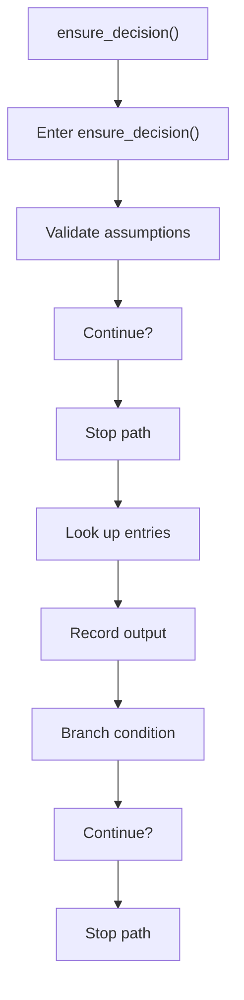
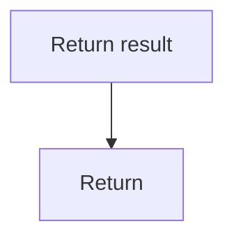

# ensure_decision.cpp

- Source document: [creational_code_generator_internal.cpp.md](../../creational_code_generator_internal.cpp.md)
- Purpose: decoupled implementation logic for a future code unit.

### ensure_decision()
This routine owns one focused piece of the file's behavior. It appears near line 271.

Inside the body, it mainly handles validate assumptions before continuing, look up entries in previously collected maps or sets, record derived output into collections, and branch on runtime conditions.

It branches on runtime conditions instead of following one fixed path. The caller receives a computed result or status from this step.

What it does:
- validate assumptions before continuing
- look up entries in previously collected maps or sets
- record derived output into collections
- branch on runtime conditions

Flow:

### Block 6 - ensure_decision() Details
#### Slice 1 - Opening Intent
Quick summary: This slice shows the opening intent of ensure_decision.cpp and the first major actions that frame the rest of the flow.
Why this is separate: ensure_decision.cpp has multiple branches, loops, or stage changes, so this section is split out to keep one major intent visible at a time instead of forcing one oversized diagram.

#### Slice 2 - Early Branches
Quick summary: This slice covers the first branch-heavy continuation of ensure_decision.cpp after the opening path has been established.
Why this is separate: ensure_decision.cpp has multiple branches, loops, or stage changes, so this section is split out to keep one major intent visible at a time instead of forcing one oversized diagram.

