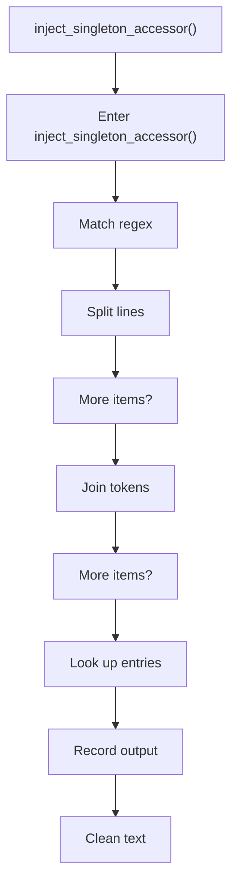
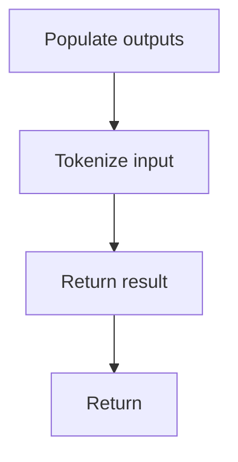

# inject_singleton_accessor.cpp

- Source document: [creational_code_generator_internal.cpp.md](../../creational_code_generator_internal.cpp.md)
- Purpose: decoupled implementation logic for a future code unit.

### inject_singleton_accessor()
This routine owns one focused piece of the file's behavior. It appears near line 171.

Inside the body, it mainly handles match source text with regular expressions, split the source into individual lines, reassemble token or line collections into text, and look up entries in previously collected maps or sets.

The implementation iterates over a collection or repeated workload. It branches on runtime conditions instead of following one fixed path. The caller receives a computed result or status from this step.

What it does:
- match source text with regular expressions
- split the source into individual lines
- reassemble token or line collections into text
- look up entries in previously collected maps or sets
- record derived output into collections
- normalize raw text before later parsing
- populate output fields or accumulators
- parse or tokenize input text
- assemble tree or artifact structures
- serialize report content
- iterate over the active collection
- branch on runtime conditions

Flow:

### Block 4 - inject_singleton_accessor() Details
#### Slice 1 - Opening Intent
Quick summary: This slice shows the opening intent of inject_singleton_accessor.cpp and the first major actions that frame the rest of the flow.
Why this is separate: inject_singleton_accessor.cpp has multiple branches, loops, or stage changes, so this section is split out to keep one major intent visible at a time instead of forcing one oversized diagram.

#### Slice 2 - Early Branches
Quick summary: This slice covers the first branch-heavy continuation of inject_singleton_accessor.cpp after the opening path has been established.
Why this is separate: inject_singleton_accessor.cpp has multiple branches, loops, or stage changes, so this section is split out to keep one major intent visible at a time instead of forcing one oversized diagram.

