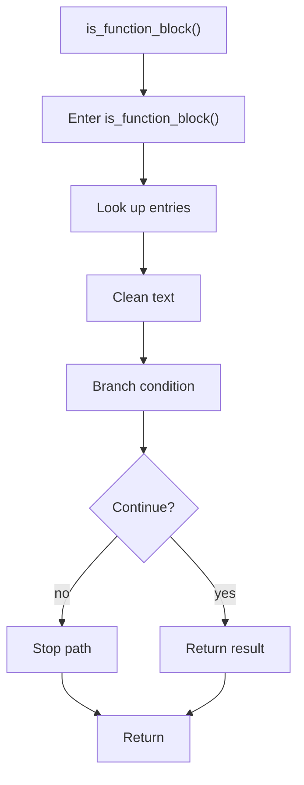

# is_function_block.cpp

- Source document: [creational_code_generator_internal.cpp.md](../../creational_code_generator_internal.cpp.md)
- Purpose: decoupled implementation logic for a future code unit.

### is_function_block()
This routine owns one focused piece of the file's behavior. It appears near line 115.

Inside the body, it mainly handles look up entries in previously collected maps or sets, normalize raw text before later parsing, and branch on runtime conditions.

It branches on runtime conditions instead of following one fixed path. The caller receives a computed result or status from this step.

What it does:
- look up entries in previously collected maps or sets
- normalize raw text before later parsing
- branch on runtime conditions

Flow:

