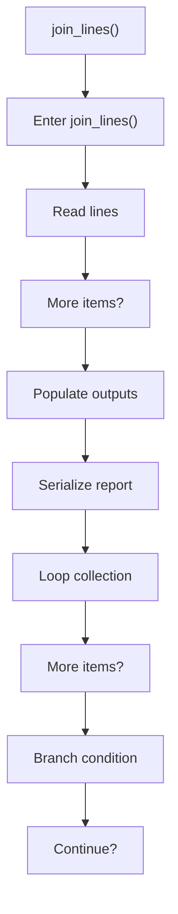
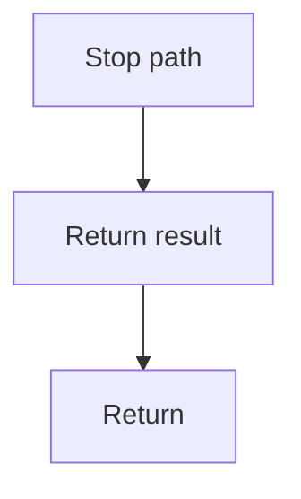

# join_lines.cpp

- Source document: [creational_code_generator_internal.cpp.md](../../creational_code_generator_internal.cpp.md)
- Purpose: decoupled implementation logic for a future code unit.

### join_lines()
This routine owns one focused piece of the file's behavior. It appears near line 320.

Inside the body, it mainly handles work one source line at a time, populate output fields or accumulators, serialize report content, and iterate over the active collection.

The implementation iterates over a collection or repeated workload. It branches on runtime conditions instead of following one fixed path. The caller receives a computed result or status from this step.

What it does:
- work one source line at a time
- populate output fields or accumulators
- serialize report content
- iterate over the active collection
- branch on runtime conditions

Flow:

### Block 9 - join_lines() Details
#### Slice 1 - Opening Intent
Quick summary: This slice shows the opening intent of join_lines.cpp and the first major actions that frame the rest of the flow.
Why this is separate: join_lines.cpp has multiple branches, loops, or stage changes, so this section is split out to keep one major intent visible at a time instead of forcing one oversized diagram.

#### Slice 2 - Early Branches
Quick summary: This slice covers the first branch-heavy continuation of join_lines.cpp after the opening path has been established.
Why this is separate: join_lines.cpp has multiple branches, loops, or stage changes, so this section is split out to keep one major intent visible at a time instead of forcing one oversized diagram.

