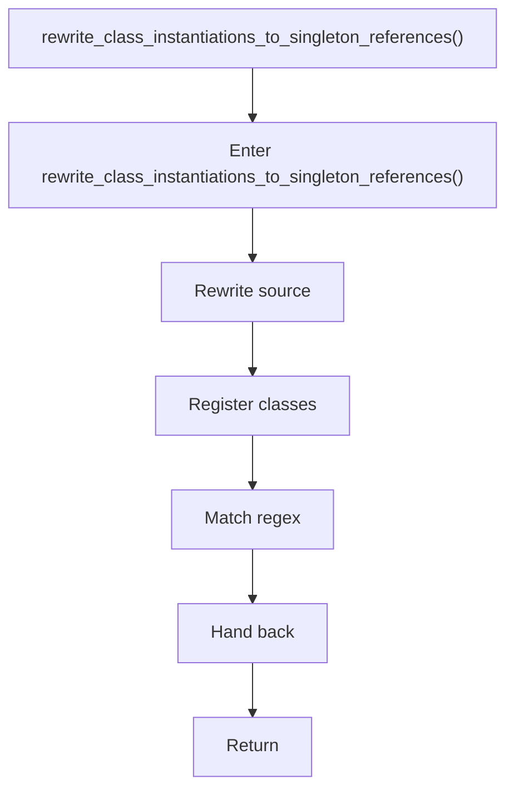

# rewrite_class_instantiations_to_singleton_references.cpp

- Source document: [creational_code_generator_internal.cpp.md](../../creational_code_generator_internal.cpp.md)
- Purpose: decoupled implementation logic for a future code unit.

### rewrite_class_instantiations_to_singleton_references()
This routine owns one focused piece of the file's behavior. It appears near line 222.

Inside the body, it mainly handles rewrite source text or model state, inspect or register class-level information, and match source text with regular expressions.

What it does:
- rewrite source text or model state
- inspect or register class-level information
- match source text with regular expressions

Flow:

