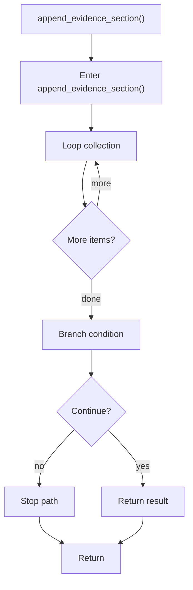

# append_evidence_section.cpp

- Source document: [creational_transform_evidence_render.cpp.md](../../creational_transform_evidence_render.cpp.md)
- Purpose: decoupled implementation logic for a future code unit.

### append_evidence_section()
This helper reshapes small pieces of data so the surrounding code can stay readable. It appears near line 134.

Inside the body, it mainly handles iterate over the active collection and branch on runtime conditions.

The implementation iterates over a collection or repeated workload. It branches on runtime conditions instead of following one fixed path. The caller receives a computed result or status from this step.

What it does:
- iterate over the active collection
- branch on runtime conditions

Flow:

