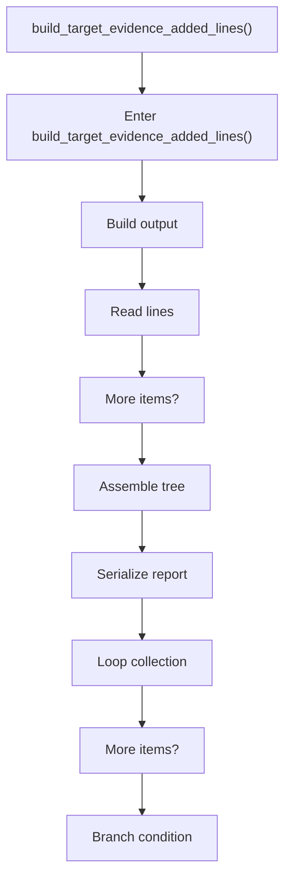
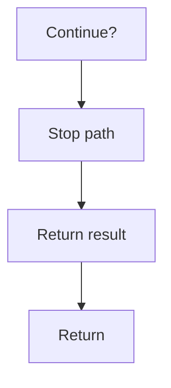

# build_target_evidence_added_lines.cpp

- Source document: [creational_transform_evidence_render.cpp.md](../../creational_transform_evidence_render.cpp.md)
- Purpose: decoupled implementation logic for a future code unit.

### build_target_evidence_added_lines()
This routine assembles a larger structure from the inputs it receives. It appears near line 88.

Inside the body, it mainly handles build or append the next output structure, work one source line at a time, assemble tree or artifact structures, and serialize report content.

The implementation iterates over a collection or repeated workload. It branches on runtime conditions instead of following one fixed path. The caller receives a computed result or status from this step.

What it does:
- build or append the next output structure
- work one source line at a time
- assemble tree or artifact structures
- serialize report content
- iterate over the active collection
- branch on runtime conditions

Flow:

### Block 4 - build_target_evidence_added_lines() Details
#### Slice 1 - Opening Intent
Quick summary: This slice shows the opening intent of build_target_evidence_added_lines.cpp and the first major actions that frame the rest of the flow.
Why this is separate: build_target_evidence_added_lines.cpp has multiple branches, loops, or stage changes, so this section is split out to keep one major intent visible at a time instead of forcing one oversized diagram.

#### Slice 2 - Early Branches
Quick summary: This slice covers the first branch-heavy continuation of build_target_evidence_added_lines.cpp after the opening path has been established.
Why this is separate: build_target_evidence_added_lines.cpp has multiple branches, loops, or stage changes, so this section is split out to keep one major intent visible at a time instead of forcing one oversized diagram.

