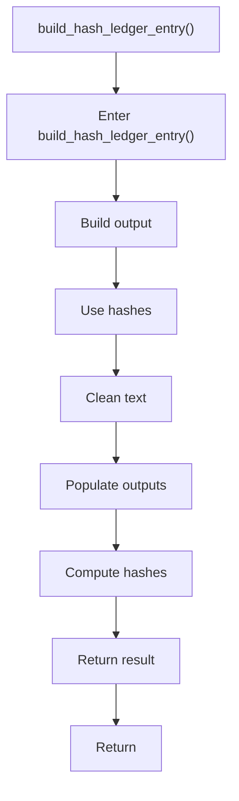

# build_hash_ledger_entry.cpp

- Source document: [creational_transform_factory_reverse_parse_literals.cpp.md](../../creational_transform_factory_reverse_parse_literals.cpp.md)
- Purpose: decoupled implementation logic for a future code unit.

### build_hash_ledger_entry()
This routine assembles a larger structure from the inputs it receives. It appears near line 173.

Inside the body, it mainly handles build or append the next output structure, compute or reuse hash-oriented identifiers, normalize raw text before later parsing, and populate output fields or accumulators.

The caller receives a computed result or status from this step.

What it does:
- build or append the next output structure
- compute or reuse hash-oriented identifiers
- normalize raw text before later parsing
- populate output fields or accumulators
- compute hash metadata

Flow:

