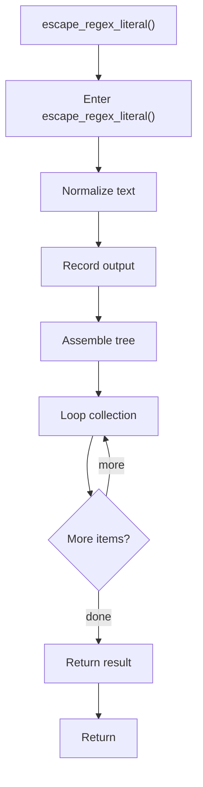

# escape_regex_literal.cpp

- Source document: [creational_transform_factory_reverse_parse_literals.cpp.md](../../creational_transform_factory_reverse_parse_literals.cpp.md)
- Purpose: decoupled implementation logic for a future code unit.

### escape_regex_literal()
This helper reshapes small pieces of data so the surrounding code can stay readable. It appears near line 12.

Inside the body, it mainly handles normalize or format text values, record derived output into collections, assemble tree or artifact structures, and iterate over the active collection.

The implementation iterates over a collection or repeated workload. The caller receives a computed result or status from this step.

What it does:
- normalize or format text values
- record derived output into collections
- assemble tree or artifact structures
- iterate over the active collection

Flow:

