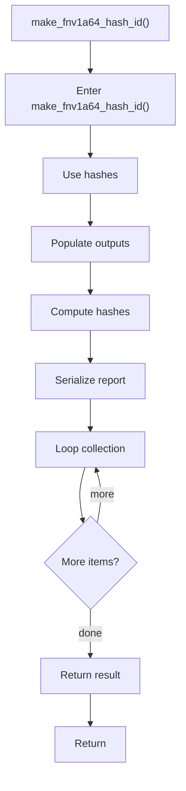

# make_fnv1a64_hash_id.cpp

- Source document: [creational_transform_factory_reverse_parse_literals.cpp.md](../../creational_transform_factory_reverse_parse_literals.cpp.md)
- Purpose: decoupled implementation logic for a future code unit.

### make_fnv1a64_hash_id()
This routine assembles a larger structure from the inputs it receives. It appears near line 155.

Inside the body, it mainly handles compute or reuse hash-oriented identifiers, populate output fields or accumulators, compute hash metadata, and serialize report content.

The implementation iterates over a collection or repeated workload. The caller receives a computed result or status from this step.

What it does:
- compute or reuse hash-oriented identifiers
- populate output fields or accumulators
- compute hash metadata
- serialize report content
- iterate over the active collection

Flow:

