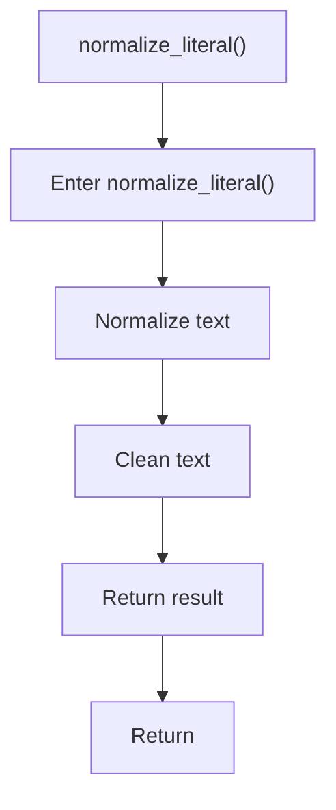

# normalize_literal.cpp

- Source document: [creational_transform_factory_reverse_parse_literals.cpp.md](../../creational_transform_factory_reverse_parse_literals.cpp.md)
- Purpose: decoupled implementation logic for a future code unit.

### normalize_literal()
This helper reshapes small pieces of data so the surrounding code can stay readable. It appears near line 120.

Inside the body, it mainly handles normalize or format text values and normalize raw text before later parsing.

The caller receives a computed result or status from this step.

What it does:
- normalize or format text values
- normalize raw text before later parsing

Flow:

