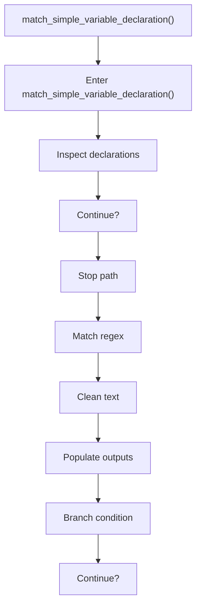
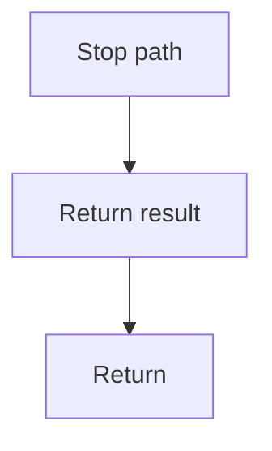

# match_simple_variable_declaration.cpp

- Source document: [creational_transform_factory_reverse_rewrite.cpp.md](../../creational_transform_factory_reverse_rewrite.cpp.md)
- Purpose: decoupled implementation logic for a future code unit.

### match_simple_variable_declaration()
This routine owns one focused piece of the file's behavior. It appears near line 31.

Inside the body, it mainly handles inspect or rewrite declarations, match source text with regular expressions, normalize raw text before later parsing, and populate output fields or accumulators.

It branches on runtime conditions instead of following one fixed path. The caller receives a computed result or status from this step.

What it does:
- inspect or rewrite declarations
- match source text with regular expressions
- normalize raw text before later parsing
- populate output fields or accumulators
- branch on runtime conditions

Flow:

### Block 3 - match_simple_variable_declaration() Details
#### Slice 1 - Opening Intent
Quick summary: This slice shows the opening intent of match_simple_variable_declaration.cpp and the first major actions that frame the rest of the flow.
Why this is separate: match_simple_variable_declaration.cpp has multiple branches, loops, or stage changes, so this section is split out to keep one major intent visible at a time instead of forcing one oversized diagram.

#### Slice 2 - Early Branches
Quick summary: This slice covers the first branch-heavy continuation of match_simple_variable_declaration.cpp after the opening path has been established.
Why this is separate: match_simple_variable_declaration.cpp has multiple branches, loops, or stage changes, so this section is split out to keep one major intent visible at a time instead of forcing one oversized diagram.

