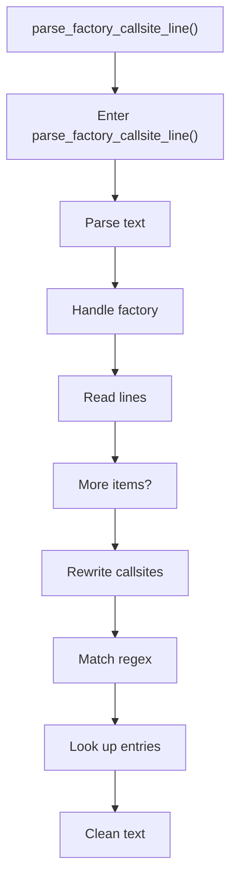
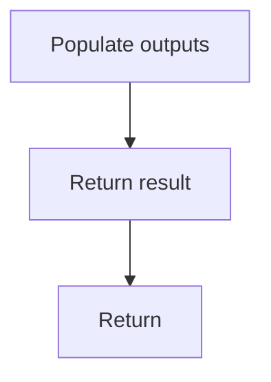

# parse_factory_callsite_line.cpp

- Source document: [creational_transform_factory_reverse_rewrite.cpp.md](../../creational_transform_factory_reverse_rewrite.cpp.md)
- Purpose: decoupled implementation logic for a future code unit.

### parse_factory_callsite_line()
This routine ingests source content and turns it into a more useful structured form. It appears near line 243.

Inside the body, it mainly handles parse source text into structured values, handle factory-specific detection or rewrite logic, work one source line at a time, and recognize or rewrite callsite structure.

It branches on runtime conditions instead of following one fixed path. The caller receives a computed result or status from this step.

What it does:
- parse source text into structured values
- handle factory-specific detection or rewrite logic
- work one source line at a time
- recognize or rewrite callsite structure
- match source text with regular expressions
- look up entries in previously collected maps or sets
- normalize raw text before later parsing
- populate output fields or accumulators
- branch on runtime conditions

Flow:

### Block 7 - parse_factory_callsite_line() Details
#### Slice 1 - Opening Intent
Quick summary: This slice shows the opening intent of parse_factory_callsite_line.cpp and the first major actions that frame the rest of the flow.
Why this is separate: parse_factory_callsite_line.cpp has multiple branches, loops, or stage changes, so this section is split out to keep one major intent visible at a time instead of forcing one oversized diagram.

#### Slice 2 - Early Branches
Quick summary: This slice covers the first branch-heavy continuation of parse_factory_callsite_line.cpp after the opening path has been established.
Why this is separate: parse_factory_callsite_line.cpp has multiple branches, loops, or stage changes, so this section is split out to keep one major intent visible at a time instead of forcing one oversized diagram.

