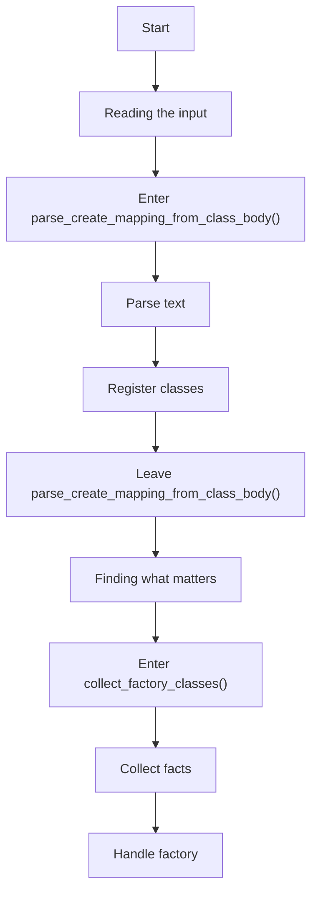
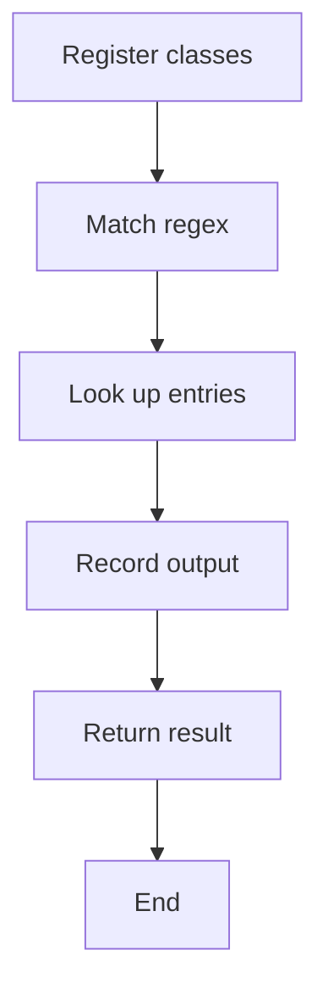
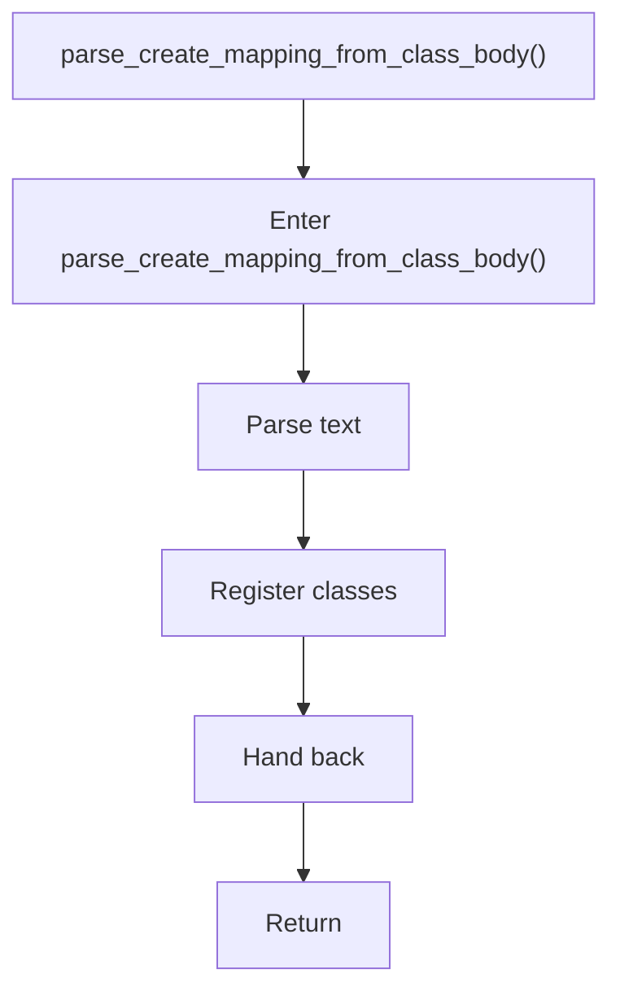
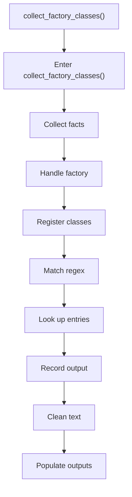
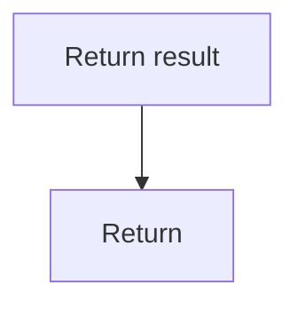

# creational_transform_factory_reverse_parse.cpp

- Source: Microservice/Modules/Source/Creational/Transform/creational_transform_factory_reverse_parse.cpp
- Kind: C++ implementation
- Lines: 165

## Story
### What Happens Here

This source file belongs to the older creational transform support path. It is useful for understanding previous rewrite behavior, but the current analyzer runtime focuses on tagging evidence instead of generating replacement code. This source file implements creational-pattern analysis over the generic parse tree. It inspects parsed structure, applies pattern-specific rules, and emits detector results that later appear in the creational tree or documentation tags.

### Why It Matters In The Flow

Runs after the generic parse tree exists so creational detection can label the structure.

### What To Watch While Reading

Implements creational transform dispatch, evidence rendering, and rewrite helpers. The main surface area is easiest to track through symbols such as parse_create_mapping_from_class_body, collect_factory_classes, and class_regex. It collaborates directly with internal/creational_transform_factory_reverse_internal.hpp, Transform/creational_code_generator_internal.hpp, cctype, and regex.

## Program Flow
This diagram follows the action path in plain words. Decision diamonds show where the file can stop, branch, or repeat work instead of simply passing through a straight line.

The flow is intentionally split into smaller slices so the major intent of creational_transform_factory_reverse_parse.cpp stays readable. Each slice names the stage it is covering, gives a quick summary, and explains why that stage is separated from the next one.

### Program Flow Slices
#### Slice 1 - Opening Intent
Quick summary: This slice shows the opening intent of creational_transform_factory_reverse_parse.cpp and the first major actions that frame the rest of the flow.
Why this is separate: creational_transform_factory_reverse_parse.cpp has multiple branches, loops, or stage changes, so this section is split out to keep one major intent visible at a time instead of forcing one oversized diagram.

#### Slice 2 - Early Branches
Quick summary: This slice covers the first branch-heavy continuation of creational_transform_factory_reverse_parse.cpp after the opening path has been established.
Why this is separate: creational_transform_factory_reverse_parse.cpp has multiple branches, loops, or stage changes, so this section is split out to keep one major intent visible at a time instead of forcing one oversized diagram.

## Reading Map
Read this file as: Implements creational transform dispatch, evidence rendering, and rewrite helpers.

Where it sits in the run: Runs after the generic parse tree exists so creational detection can label the structure.

Names worth recognizing while reading: parse_create_mapping_from_class_body, collect_factory_classes, and class_regex.

It leans on nearby contracts or tools such as internal/creational_transform_factory_reverse_internal.hpp, Transform/creational_code_generator_internal.hpp, cctype, regex, string, and vector.

## Story Groups

### Reading The Input
These steps turn raw text or arguments into something the program can follow.
- parse_create_mapping_from_class_body() (line 11): Parse source text into structured values and inspect or register class-level information

### Finding What Matters
These steps pick out the facts, traces, and relationships that later stages need.
- collect_factory_classes() (line 103): Collect derived facts for later stages, handle factory-specific detection or rewrite logic, and inspect or register class-level information

## Function Stories

### parse_create_mapping_from_class_body()
This routine ingests source content and turns it into a more useful structured form. It appears near line 11.

Inside the body, it mainly handles parse source text into structured values and inspect or register class-level information.

What it does:
- parse source text into structured values
- inspect or register class-level information

Flow:

### collect_factory_classes()
This routine connects discovered items back into the broader model owned by the file. It appears near line 103.

Inside the body, it mainly handles collect derived facts for later stages, handle factory-specific detection or rewrite logic, inspect or register class-level information, and match source text with regular expressions.

The implementation iterates over a collection or repeated workload. It branches on runtime conditions instead of following one fixed path. The caller receives a computed result or status from this step.

What it does:
- collect derived facts for later stages
- handle factory-specific detection or rewrite logic
- inspect or register class-level information
- match source text with regular expressions
- look up entries in previously collected maps or sets
- record derived output into collections
- normalize raw text before later parsing
- populate output fields or accumulators
- parse or tokenize input text
- assemble tree or artifact structures
- iterate over the active collection
- branch on runtime conditions

Flow:

### Block 2 - collect_factory_classes() Details
#### Slice 1 - Opening Intent
Quick summary: This slice shows the opening intent of creational_transform_factory_reverse_parse.cpp and the first major actions that frame the rest of the flow.
Why this is separate: creational_transform_factory_reverse_parse.cpp has multiple branches, loops, or stage changes, so this section is split out to keep one major intent visible at a time instead of forcing one oversized diagram.

#### Slice 2 - Early Branches
Quick summary: This slice covers the first branch-heavy continuation of creational_transform_factory_reverse_parse.cpp after the opening path has been established.
Why this is separate: creational_transform_factory_reverse_parse.cpp has multiple branches, loops, or stage changes, so this section is split out to keep one major intent visible at a time instead of forcing one oversized diagram.

## Documentation Note
- This markdown file is part of the generated docs/Codebase mirror.
- It was generated from the repository state on 2026-04-23 after reading the existing docs corpus and the current source tree.

