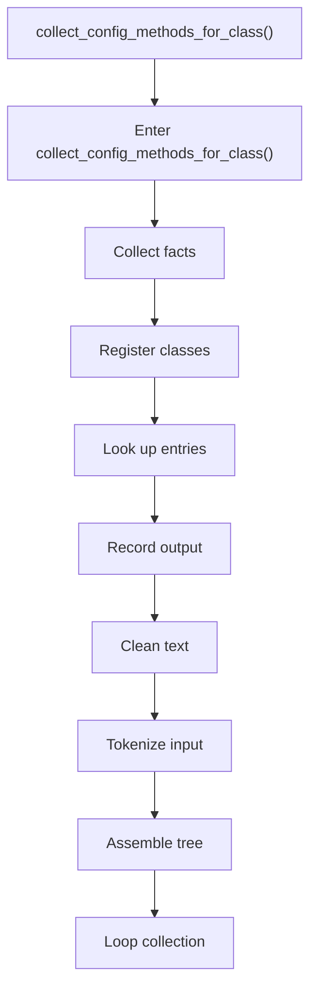
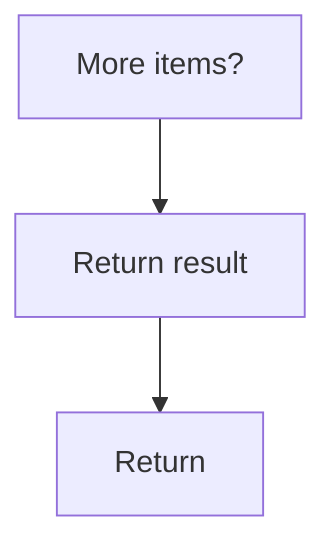

# collect_config_methods_for_class.cpp

- Source document: [creational_transform_rules.cpp.md](../../creational_transform_rules.cpp.md)
- Purpose: decoupled implementation logic for a future code unit.

### collect_config_methods_for_class()
This routine connects discovered items back into the broader model owned by the file. It appears near line 72.

Inside the body, it mainly handles collect derived facts for later stages, inspect or register class-level information, look up entries in previously collected maps or sets, and record derived output into collections.

The implementation iterates over a collection or repeated workload. It branches on runtime conditions instead of following one fixed path. The caller receives a computed result or status from this step.

What it does:
- collect derived facts for later stages
- inspect or register class-level information
- look up entries in previously collected maps or sets
- record derived output into collections
- normalize raw text before later parsing
- parse or tokenize input text
- assemble tree or artifact structures
- iterate over the active collection
- branch on runtime conditions

Flow:

### Block 3 - collect_config_methods_for_class() Details
#### Slice 1 - Opening Intent
Quick summary: This slice shows the opening intent of collect_config_methods_for_class.cpp and the first major actions that frame the rest of the flow.
Why this is separate: collect_config_methods_for_class.cpp has multiple branches, loops, or stage changes, so this section is split out to keep one major intent visible at a time instead of forcing one oversized diagram.

#### Slice 2 - Early Branches
Quick summary: This slice covers the first branch-heavy continuation of collect_config_methods_for_class.cpp after the opening path has been established.
Why this is separate: collect_config_methods_for_class.cpp has multiple branches, loops, or stage changes, so this section is split out to keep one major intent visible at a time instead of forcing one oversized diagram.

