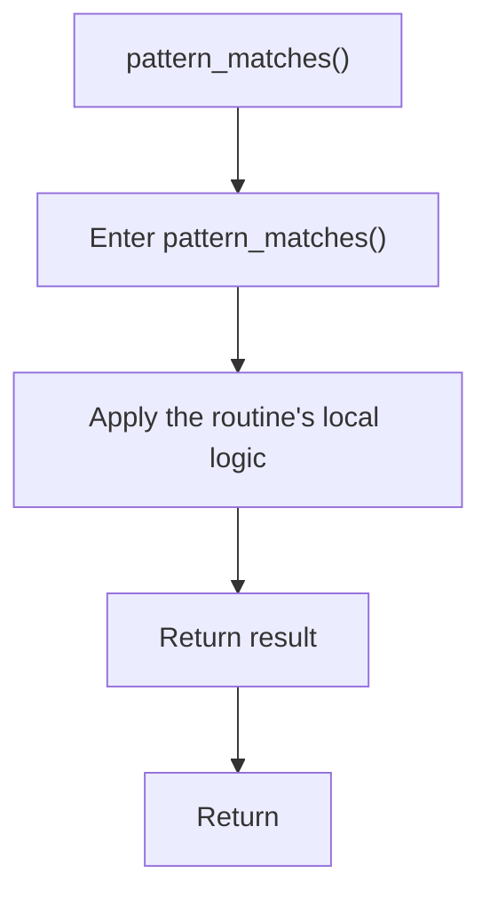

# pattern_matches.cpp

- Source document: [creational_transform_rules.cpp.md](../../creational_transform_rules.cpp.md)
- Purpose: decoupled implementation logic for a future code unit.

### pattern_matches()
This routine owns one focused piece of the file's behavior. It appears near line 497.

The caller receives a computed result or status from this step.

What it does:
- This routine is primarily structural and does not expose obvious runtime operations from static inspection.

Flow:

