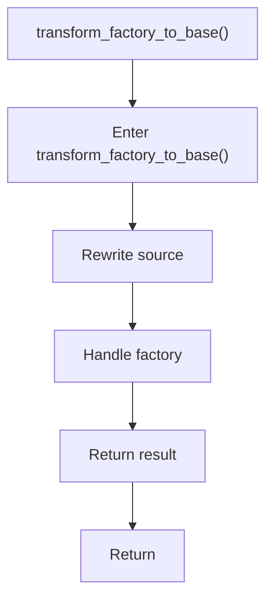

# transform_factory_to_base.cpp

- Source document: [creational_transform_rules.cpp.md](../../creational_transform_rules.cpp.md)
- Purpose: decoupled implementation logic for a future code unit.

### transform_factory_to_base()
This routine owns one focused piece of the file's behavior. It appears near line 388.

Inside the body, it mainly handles rewrite source text or model state and handle factory-specific detection or rewrite logic.

The caller receives a computed result or status from this step.

What it does:
- rewrite source text or model state
- handle factory-specific detection or rewrite logic

Flow:

