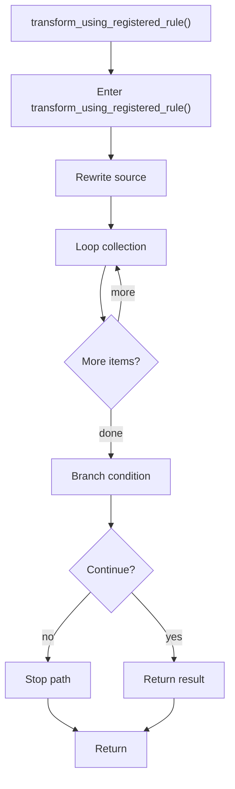

# transform_using_registered_rule.cpp

- Source document: [creational_transform_rules.cpp.md](../../creational_transform_rules.cpp.md)
- Purpose: decoupled implementation logic for a future code unit.

### transform_using_registered_rule()
This routine owns one focused piece of the file's behavior. It appears near line 513.

Inside the body, it mainly handles rewrite source text or model state, iterate over the active collection, and branch on runtime conditions.

The implementation iterates over a collection or repeated workload. It branches on runtime conditions instead of following one fixed path. The caller receives a computed result or status from this step.

What it does:
- rewrite source text or model state
- iterate over the active collection
- branch on runtime conditions

Flow:

