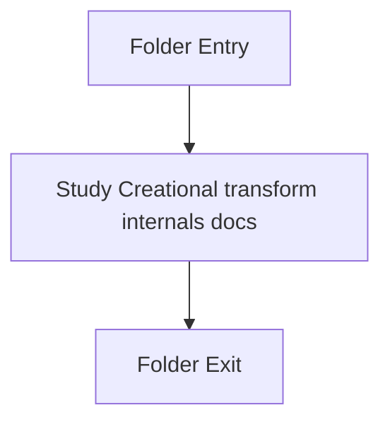

# internal

- Folder: docs/Codebase/Microservice/Modules/Source/Creational/Transform/internal
- Descendant source docs: 2
- Generated on: 2026-04-23

## Logic Summary
Internal helpers used by the older creational transform path.

## Subsystem Story
This folder is mostly leaf-level. The local documents here carry the main explanation of the subsystem without requiring much extra descent.

## Folder Flow

## Documents By Logic
### Creational Transform Internals
These documents explain the local implementation by covering Implements creational transform dispatch, evidence rendering, and rewrite helpers..
- creational_transform_evidence_internal.hpp.md : Implements creational transform dispatch, evidence rendering, and rewrite helpers.
- creational_transform_factory_reverse_internal.hpp.md : Implements creational transform dispatch, evidence rendering, and rewrite helpers.

## Reading Hint
- This folder is mostly leaf-level. Read the local file docs to understand the logic in this area.

