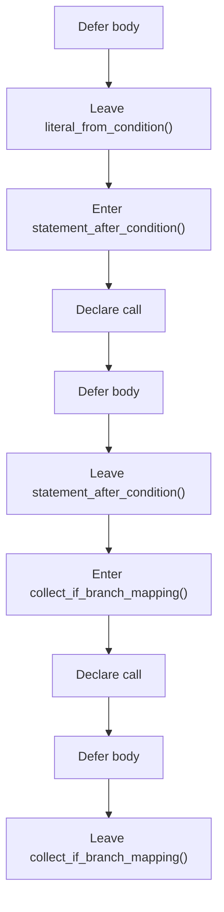
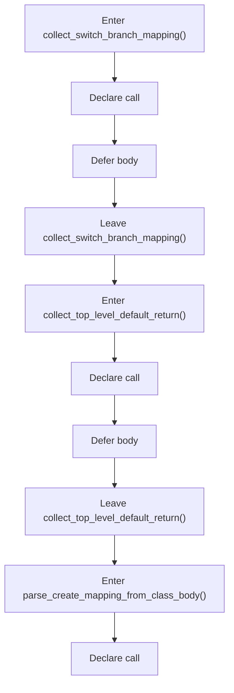
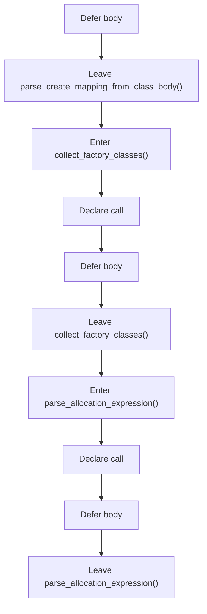
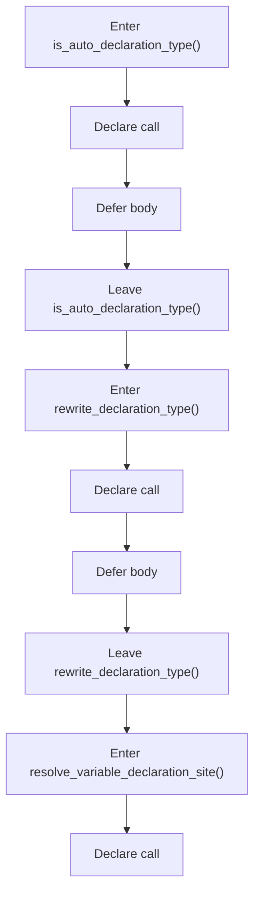
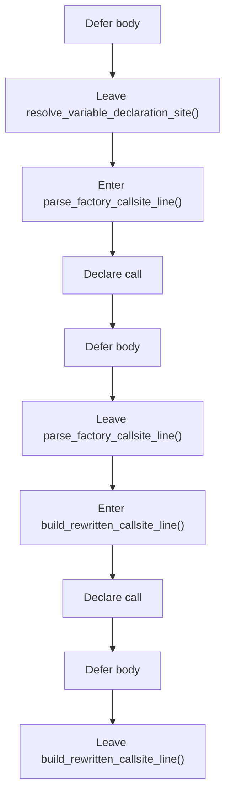
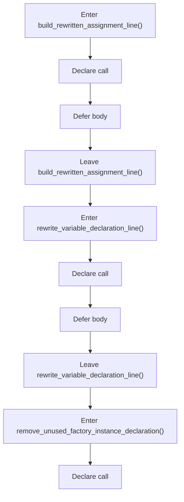
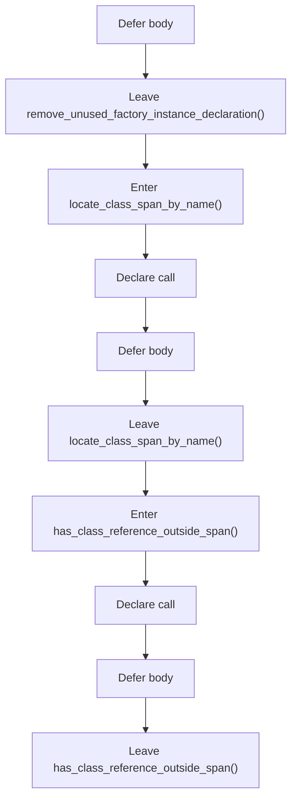
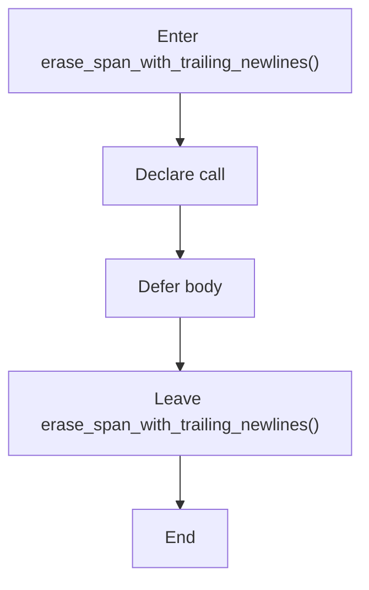

# creational_transform_factory_reverse_internal_program_flow_02.cpp

- Source document: [creational_transform_factory_reverse_internal.hpp.md](../creational_transform_factory_reverse_internal.hpp.md)
- Purpose: decoupled implementation logic for a future code unit.

#### Slice 9 - Return Path
Quick summary: This slice closes creational_transform_factory_reverse_internal_program_flow_02.cpp and shows the final return or stop path.
Why this is separate: creational_transform_factory_reverse_internal_program_flow_02.cpp has multiple branches, loops, or stage changes, so this section is split out to keep one major intent visible at a time instead of forcing one oversized diagram.

#### Slice 10 - Flow Slice 10
Quick summary: This slice covers one readable stage of creational_transform_factory_reverse_internal_program_flow_02.cpp without collapsing the entire flow into one oversized Mermaid block.
Why this is separate: creational_transform_factory_reverse_internal_program_flow_02.cpp has multiple branches, loops, or stage changes, so this section is split out to keep one major intent visible at a time instead of forcing one oversized diagram.

#### Slice 11 - Flow Slice 11
Quick summary: This slice covers one readable stage of creational_transform_factory_reverse_internal_program_flow_02.cpp without collapsing the entire flow into one oversized Mermaid block.
Why this is separate: creational_transform_factory_reverse_internal_program_flow_02.cpp has multiple branches, loops, or stage changes, so this section is split out to keep one major intent visible at a time instead of forcing one oversized diagram.

#### Slice 12 - Flow Slice 12
Quick summary: This slice covers one readable stage of creational_transform_factory_reverse_internal_program_flow_02.cpp without collapsing the entire flow into one oversized Mermaid block.
Why this is separate: creational_transform_factory_reverse_internal_program_flow_02.cpp has multiple branches, loops, or stage changes, so this section is split out to keep one major intent visible at a time instead of forcing one oversized diagram.

#### Slice 13 - Flow Slice 13
Quick summary: This slice covers one readable stage of creational_transform_factory_reverse_internal_program_flow_02.cpp without collapsing the entire flow into one oversized Mermaid block.
Why this is separate: creational_transform_factory_reverse_internal_program_flow_02.cpp has multiple branches, loops, or stage changes, so this section is split out to keep one major intent visible at a time instead of forcing one oversized diagram.

#### Slice 14 - Flow Slice 14
Quick summary: This slice covers one readable stage of creational_transform_factory_reverse_internal_program_flow_02.cpp without collapsing the entire flow into one oversized Mermaid block.
Why this is separate: creational_transform_factory_reverse_internal_program_flow_02.cpp has multiple branches, loops, or stage changes, so this section is split out to keep one major intent visible at a time instead of forcing one oversized diagram.

#### Slice 15 - Flow Slice 15
Quick summary: This slice covers one readable stage of creational_transform_factory_reverse_internal_program_flow_02.cpp without collapsing the entire flow into one oversized Mermaid block.
Why this is separate: creational_transform_factory_reverse_internal_program_flow_02.cpp has multiple branches, loops, or stage changes, so this section is split out to keep one major intent visible at a time instead of forcing one oversized diagram.

#### Slice 16 - Flow Slice 16
Quick summary: This slice covers one readable stage of creational_transform_factory_reverse_internal_program_flow_02.cpp without collapsing the entire flow into one oversized Mermaid block.
Why this is separate: creational_transform_factory_reverse_internal_program_flow_02.cpp has multiple branches, loops, or stage changes, so this section is split out to keep one major intent visible at a time instead of forcing one oversized diagram.

