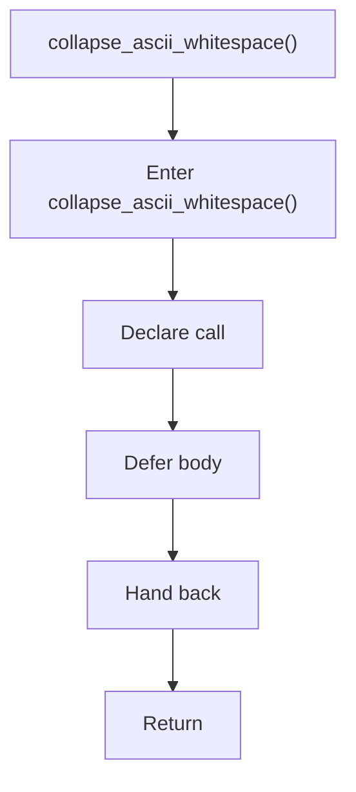

# collapse_ascii_whitespace.cpp

- Source document: [creational_transform_factory_reverse_internal.hpp.md](../../creational_transform_factory_reverse_internal.hpp.md)
- Purpose: decoupled implementation logic for a future code unit.

### collapse_ascii_whitespace()
This declaration exposes a callable contract without providing the runtime body here. It appears near line 105.

Inside the body, it mainly handles declare a callable contract and let implementation files define the runtime body.

What it does:
- declare a callable contract
- let implementation files define the runtime body

Flow:

