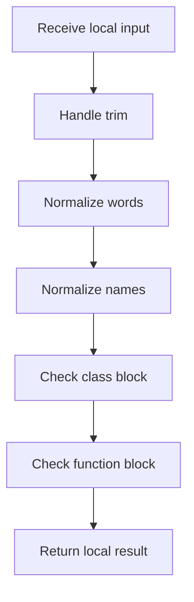

# behavioural_logic_scaffold.cpp

- Source: Microservice/Modules/Source/Behavioural/Logic/behavioural_logic_scaffold.cpp
- Kind: C++ implementation

## Story
### What Happens Here

This source file implements behavioural-pattern scaffolding or checks on top of the generic parse tree. It contributes one part of the behavioural broken-tree output by scanning for behavioural structure signals.

### Why It Matters In The Flow

Runs after the generic parse tree exists so behavioural scaffolds can classify pattern structure.

### What To Watch While Reading

Implements behavioural detection and structural verification scaffolds. The main surface area is easiest to track through symbols such as BehaviouralClassSignals, trim, lower, and lowercase_ascii. It collaborates directly with Logic/behavioural_logic_scaffold.hpp, Language-and-Structure/language_tokens.hpp, parse_tree_dependency_utils.hpp, and cctype.

This family should plug into the shared hook contract. `build_behavioural_function_scaffold()` and `build_behavioural_structure_checker()` are family-specific hook builders, not separate dispatcher shapes. They should return the evidence shape expected by the middleman interface.

## Program Flow
Quick summary: this diagram shows the file-local activity path for this implementation unit. It stays inside this code file and uses only entry and return boundaries as external references.

Why this slice is separate: deeper helper docs can explain individual functions, while this file still needs to show the main activity path in place.

Detailed program flow is decoupled into future implementation units:

- [program_flow_01](./Flow/behavioural_logic_scaffold_program_flow_01.cpp.md)
- [program_flow_02](./Flow/behavioural_logic_scaffold_program_flow_02.cpp.md)
## Reading Map
Read this file as: Implements behavioural detection and structural verification scaffolds.

Where it sits in the run: Runs after the generic parse tree exists so behavioural scaffolds can classify pattern structure.

Names worth recognizing while reading: BehaviouralClassSignals, trim, lower, lowercase_ascii, split_words, and starts_with.

It leans on nearby contracts or tools such as Logic/behavioural_logic_scaffold.hpp, Language-and-Structure/language_tokens.hpp, parse_tree_dependency_utils.hpp, cctype, string, and utility.

## Story Groups

### Small Preparation Steps
These steps clean up names, text, or small values before the larger work begins.
- trim(): Normalize or format text values, normalize raw text before later parsing, and walk the local collection
- split_words(): Split source text into smaller units, store local findings, and connect local structures
- join_names(): walk the local collection and branch on local conditions

### Checks Before Moving On
These steps stop bad input or unsupported state before it can confuse the next part of the run.
- is_class_block(): Inspect or register class-level information, normalize raw text before later parsing, and branch on local conditions
- is_function_block(): look up local indexes, normalize raw text before later parsing, and branch on local conditions
- has_keyword(): look up local indexes, walk the local collection, and branch on local conditions

### Finding What Matters
These steps pick out the facts, traces, and relationships that later stages need.
- collect_class_signals(): Collect derived facts for later stages, inspect or register class-level information, and look up local indexes

### Building The Working Picture
These steps assemble the trees, models, or bundles used by the rest of the file.
- subtree_mentions_keyword(): store local findings, connect local structures, and walk the local collection
- build_behavioural_function_scaffold(): Create the local output structure, look up local indexes, and store local findings
- build_behavioural_structure_checker(): Create the local output structure, store local findings, and read local tokens

### Main Path
These steps drive the main execution path by calling the supporting work in order.
- starts_with(): Drive the main execution path

### Supporting Steps
These steps support the local behavior of the file.
- lower(): Owns a focused local responsibility.
- class_name_from_signature(): Inspect or register class-level information, walk the local collection, and branch on local conditions
- function_name_from_signature(): look up local indexes, normalize raw text before later parsing, and branch on local conditions

## Function Stories
Function-level logic is decoupled into future implementation units:

- [trim](./Flow/functions/trim.cpp.md)
- [lower](./Flow/functions/lower.cpp.md)
- [split_words](./Flow/functions/split_words.cpp.md)
- [starts_with](./Flow/functions/starts_with.cpp.md)
- [class_name_from_signature](./Flow/functions/class_name_from_signature.cpp.md)
- [function_name_from_signature](./Flow/functions/function_name_from_signature.cpp.md)
- [is_class_block](./Flow/functions/is_class_block.cpp.md)
- [is_function_block](./Flow/functions/is_function_block.cpp.md)
- [has_keyword](./Flow/functions/has_keyword.cpp.md)
- [join_names](./Flow/functions/join_names.cpp.md)
- [subtree_mentions_keyword](./Flow/functions/subtree_mentions_keyword.cpp.md)
- [collect_class_signals](./Flow/functions/collect_class_signals.cpp.md)
- [build_behavioural_function_scaffold](./Flow/functions/build_behavioural_function_scaffold.cpp.md)
- [build_behavioural_structure_checker](./Flow/functions/build_behavioural_structure_checker.cpp.md)
## Documentation Note
- This markdown file is part of the generated docs/Codebase mirror.
- It was generated from the repository state on 2026-04-23 after reading the existing docs corpus and the current source tree.
