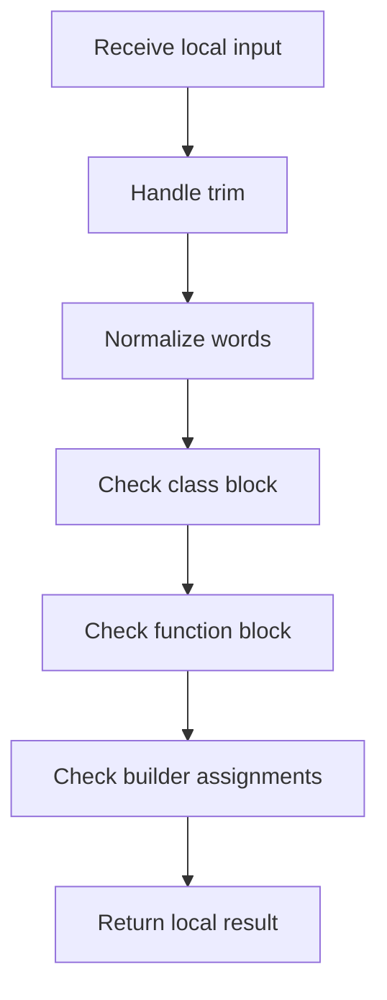

# builder_pattern_logic.cpp

- Source: Microservice/Modules/Source/Creational/Builder/builder_pattern_logic.cpp
- Kind: C++ implementation

## Story
### What Happens Here

This source file implements creational-pattern analysis over the generic parse tree. It inspects parsed structure, applies pattern-specific rules, and emits detector results that later appear in the creational tree or documentation tags.

### Why It Matters In The Flow

Runs after the generic parse tree exists so creational detection can label the structure.

### What To Watch While Reading

Implements creational pattern detection over the generic parse tree. The main surface area is easiest to track through symbols such as trim, split_words, lower, and lowercase_ascii. It collaborates directly with Builder/builder_pattern_logic.hpp, Language-and-Structure/language_tokens.hpp, cctype, and string.

## Program Flow
Quick summary: this diagram shows the file-local activity path for this implementation unit. It stays inside this code file and uses only entry and return boundaries as external references.

Why this slice is separate: deeper helper docs can explain individual functions, while this file still needs to show the main activity path in place.

Detailed program flow is decoupled into future implementation units:

- [program_flow_01](./Flow/builder_pattern_logic_program_flow_01.cpp.md)
- [program_flow_02](./Flow/builder_pattern_logic_program_flow_02.cpp.md)
## Reading Map
Read this file as: Implements creational pattern detection over the generic parse tree.

Where it sits in the run: Runs after the generic parse tree exists so creational detection can label the structure.

Names worth recognizing while reading: trim, split_words, lower, lowercase_ascii, starts_with, and is_class_block.

It leans on nearby contracts or tools such as Builder/builder_pattern_logic.hpp, Language-and-Structure/language_tokens.hpp, cctype, string, utility, and vector.

## Story Groups

### Small Preparation Steps
These steps clean up names, text, or small values before the larger work begins.
- trim(): Normalize or format text values, normalize raw text before later parsing, and walk the local collection
- split_words(): Split source text into smaller units, store local findings, and connect local structures

### Checks Before Moving On
These steps stop bad input or unsupported state before it can confuse the next part of the run.
- is_class_block(): Inspect or register class-level information, normalize raw text before later parsing, and branch on local conditions
- is_function_block(): look up local indexes, normalize raw text before later parsing, and branch on local conditions
- has_builder_assignments(): store local findings, connect local structures, and walk the local collection
- is_build_step_method(): Owns a focused local responsibility.
- check_builder_pattern_structure(): Validate assumptions before continuing, store local findings, and read local tokens

### Building The Working Picture
These steps assemble the trees, models, or bundles used by the rest of the file.
- build_builder_pattern_tree(): Create the local output structure, store local findings, and read local tokens

### Main Path
These steps drive the main execution path by calling the supporting work in order.
- starts_with(): Drive the main execution path

### Supporting Steps
These steps support the local behavior of the file.
- lower(): Owns a focused local responsibility.
- class_name(): Inspect or register class-level information, walk the local collection, and branch on local conditions
- function_name(): look up local indexes, normalize raw text before later parsing, and branch on local conditions
- returns_self_type(): look up local indexes, normalize raw text before later parsing, and branch on local conditions

## Function Stories
Function-level logic is decoupled into future implementation units:

- [trim](./Flow/functions/trim.cpp.md)
- [split_words](./Flow/functions/split_words.cpp.md)
- [lower](./Flow/functions/lower.cpp.md)
- [starts_with](./Flow/functions/starts_with.cpp.md)
- [is_class_block](./Flow/functions/is_class_block.cpp.md)
- [is_function_block](./Flow/functions/is_function_block.cpp.md)
- [class_name](./Flow/functions/class_name.cpp.md)
- [function_name](./Flow/functions/function_name.cpp.md)
- [has_builder_assignments](./Flow/functions/has_builder_assignments.cpp.md)
- [returns_self_type](./Flow/functions/returns_self_type.cpp.md)
- [is_build_step_method](./Flow/functions/is_build_step_method.cpp.md)
- [check_builder_pattern_structure](./Flow/functions/check_builder_pattern_structure.cpp.md)
- [build_builder_pattern_tree](./Flow/functions/build_builder_pattern_tree.cpp.md)
## Documentation Note
- This markdown file is part of the generated docs/Codebase mirror.
- It was generated from the repository state on 2026-04-23 after reading the existing docs corpus and the current source tree.