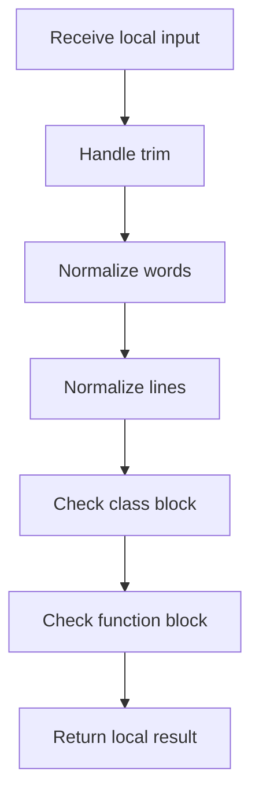

# creational_code_generator_internal.cpp

- Source: Microservice/Modules/Source/Creational/Transform/creational_code_generator_internal.cpp
- Kind: C++ implementation

## Story
### What Happens Here

This source file belongs to the older creational transform support path. It is useful for understanding previous rewrite behavior, but the current analyzer runtime focuses on tagging evidence instead of generating replacement code. This source file implements creational-pattern analysis over the generic parse tree. It inspects parsed structure, applies pattern-specific rules, and emits detector results that later appear in the creational tree or documentation tags.

### Why It Matters In The Flow

Runs after the generic parse tree exists so creational detection can label the structure.

### What To Watch While Reading

Implements creational transform dispatch, evidence rendering, and rewrite helpers. The main surface area is easiest to track through symbols such as lower, lowercase_ascii, trim, and split_words. It collaborates directly with Transform/creational_code_generator_internal.hpp, Language-and-Structure/language_tokens.hpp, cctype, and regex.

## Program Flow
Quick summary: this diagram shows the file-local activity path for this implementation unit. It stays inside this code file and uses only entry and return boundaries as external references.

Why this slice is separate: deeper helper docs can explain individual functions, while this file still needs to show the main activity path in place.

Detailed program flow is decoupled into future implementation units:

- [program_flow_01](./Flow/creational_code_generator_internal_program_flow_01.cpp.md)
- [program_flow_02](./Flow/creational_code_generator_internal_program_flow_02.cpp.md)
- [program_flow_03](./Flow/creational_code_generator_internal_program_flow_03.cpp.md)
## Reading Map
Read this file as: Implements creational transform dispatch, evidence rendering, and rewrite helpers.

Where it sits in the run: Runs after the generic parse tree exists so creational detection can label the structure.

Names worth recognizing while reading: lower, lowercase_ascii, trim, split_words, starts_with, and find_matching_brace.

It leans on nearby contracts or tools such as Transform/creational_code_generator_internal.hpp, Language-and-Structure/language_tokens.hpp, cctype, regex, sstream, and string.

## Story Groups

### Small Preparation Steps
These steps clean up names, text, or small values before the larger work begins.
- trim(): Normalize or format text values, normalize raw text before later parsing, and walk the local collection
- split_words(): Split source text into smaller units, store local findings, and connect local structures
- split_lines(): Split source text into smaller units, work one source line at a time, and store local findings
- join_lines(): Work one source line at a time, fill local output fields, and serialize report content

### Checks Before Moving On
These steps stop bad input or unsupported state before it can confuse the next part of the run.
- is_class_block(): Inspect or register class-level information, normalize raw text before later parsing, and walk the local collection
- is_function_block(): look up local indexes, normalize raw text before later parsing, and branch on local conditions
- ensure_decision(): Validate assumptions before continuing, look up local indexes, and store local findings
- is_config_method_name(): Owns a focused local responsibility.
- is_monolithic_config_method_name(): Owns a focused local responsibility.
- is_monolithic_build_method_name(): Owns a focused local responsibility.
- is_build_method_name(): Owns a focused local responsibility.
- is_operational_method_name(): connect local structures

### Finding What Matters
These steps pick out the facts, traces, and relationships that later stages need.
- find_matching_brace(): Search previously collected data

### Building The Working Picture
These steps assemble the trees, models, or bundles used by the rest of the file.
- inject_singleton_accessor(): Match source text with regular expressions, split the source into individual lines, and reassemble token or line collections into text
- extract_crucial_class_names(): Inspect or register class-level information, store local findings, and read local tokens
- add_reason_if_missing(): Create the local output structure, store local findings, and connect local structures
- append_unique_token(): store local findings, fill local output fields, and connect local structures
- append_unique_line(): Work one source line at a time, normalize raw text before later parsing, and connect local structures
- append_unique_lines(): Work one source line at a time, connect local structures, and walk the local collection

### Changing Or Cleaning The Picture
These steps adjust existing state or remove stale pieces after better information is available.
- rewrite_class_instantiations_to_singleton_references(): Rewrite source text or model state, inspect or register class-level information, and match source text with regular expressions

### Main Path
These steps drive the main execution path by calling the supporting work in order.
- starts_with(): Drive the main execution path

### Supporting Steps
These steps support the local behavior of the file.
- lower(): Owns a focused local responsibility.
- class_name_from_signature(): Inspect or register class-level information, walk the local collection, and branch on local conditions
- function_name_from_signature(): look up local indexes, normalize raw text before later parsing, and branch on local conditions
- ends_with(): Owns a focused local responsibility.
- strip_builder_suffix(): Normalize raw text before later parsing and branch on local conditions
- regex_capture_or_empty(): branch on local conditions

## Function Stories
Function-level logic is decoupled into future implementation units:

- [lower](./Flow/functions/lower.cpp.md)
- [trim](./Flow/functions/trim.cpp.md)
- [split_words](./Flow/functions/split_words.cpp.md)
- [starts_with](./Flow/functions/starts_with.cpp.md)
- [find_matching_brace](./Flow/functions/find_matching_brace.cpp.md)
- [is_class_block](./Flow/functions/is_class_block.cpp.md)
- [is_function_block](./Flow/functions/is_function_block.cpp.md)
- [class_name_from_signature](./Flow/functions/class_name_from_signature.cpp.md)
- [function_name_from_signature](./Flow/functions/function_name_from_signature.cpp.md)
- [inject_singleton_accessor](./Flow/functions/inject_singleton_accessor.cpp.md)
- [rewrite_class_instantiations_to_singleton_references](./Flow/functions/rewrite_class_instantiations_to_singleton_references.cpp.md)
- [extract_crucial_class_names](./Flow/functions/extract_crucial_class_names.cpp.md)
- [ensure_decision](./Flow/functions/ensure_decision.cpp.md)
- [add_reason_if_missing](./Flow/functions/add_reason_if_missing.cpp.md)
- [split_lines](./Flow/functions/split_lines.cpp.md)
- [join_lines](./Flow/functions/join_lines.cpp.md)
- [is_config_method_name](./Flow/functions/is_config_method_name.cpp.md)
- [is_monolithic_config_method_name](./Flow/functions/is_monolithic_config_method_name.cpp.md)
- [is_monolithic_build_method_name](./Flow/functions/is_monolithic_build_method_name.cpp.md)
- [is_build_method_name](./Flow/functions/is_build_method_name.cpp.md)
- [is_operational_method_name](./Flow/functions/is_operational_method_name.cpp.md)
- [ends_with](./Flow/functions/ends_with.cpp.md)
- [strip_builder_suffix](./Flow/functions/strip_builder_suffix.cpp.md)
- [append_unique_token](./Flow/functions/append_unique_token.cpp.md)
- [append_unique_line](./Flow/functions/append_unique_line.cpp.md)
- [append_unique_lines](./Flow/functions/append_unique_lines.cpp.md)
- [regex_capture_or_empty](./Flow/functions/regex_capture_or_empty.cpp.md)
## Documentation Note
- This markdown file is part of the generated docs/Codebase mirror.
- It was generated from the repository state on 2026-04-23 after reading the existing docs corpus and the current source tree.