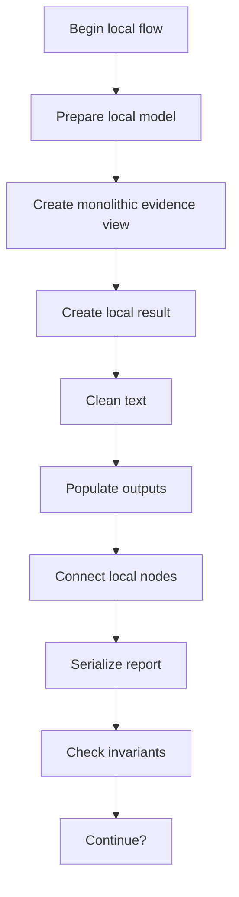
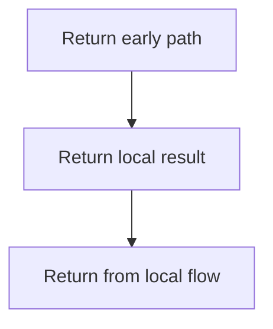
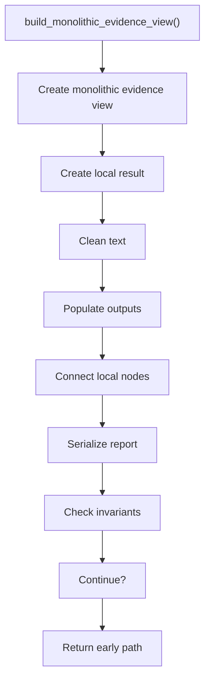
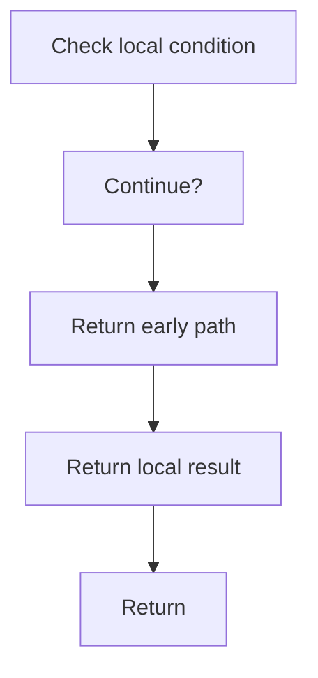

# creational_transform_evidence.cpp

- Source: Microservice/Modules/Source/Creational/Transform/creational_transform_evidence.cpp
- Kind: C++ implementation

## Story
### What Happens Here

This source file belongs to the older creational transform support path. It is useful for understanding previous rewrite behavior, but the current analyzer runtime focuses on tagging evidence instead of generating replacement code. This source file implements creational-pattern analysis over the generic parse tree. It inspects parsed structure, applies pattern-specific rules, and emits detector results that later appear in the creational tree or documentation tags.

### Why It Matters In The Flow

Runs after the generic parse tree exists so creational detection can label the structure.

### What To Watch While Reading

Implements creational transform dispatch, evidence rendering, and rewrite helpers. The main surface area is easiest to track through symbols such as build_monolithic_evidence_view, retain_single_main_function, build_source_type_skeleton_lines, and build_source_callsite_skeleton_lines. It collaborates directly with internal/creational_transform_evidence_internal.hpp.

## Program Flow
This diagram follows the action path in plain words. Decision diamonds show where the file can stop, branch, or repeat work instead of simply passing through a straight line.

The flow is intentionally split into smaller slices so the major intent of creational_transform_evidence.cpp stays readable. Each slice names the stage it is covering, gives a quick summary, and explains why that stage is separated from the next one.

### Program Flow Slices
#### Slice 1 - Establish Local Entry
Quick summary: This slice shows the first file-local stage for creational_transform_evidence.cpp and keeps the diagram scoped to this code unit.
Why this is separate: creational_transform_evidence.cpp has multiple branches, loops, or stage changes, so this section is split out to keep one major intent visible at a time instead of forcing one oversized diagram.

#### Slice 2 - Handle Early Decisions
Quick summary: This slice shows the first local decision path for creational_transform_evidence.cpp after setup.
Why this is separate: creational_transform_evidence.cpp has multiple branches, loops, or stage changes, so this section is split out to keep one major intent visible at a time instead of forcing one oversized diagram.

## Reading Map
Read this file as: Implements creational transform dispatch, evidence rendering, and rewrite helpers.

Where it sits in the run: Runs after the generic parse tree exists so creational detection can label the structure.

Names worth recognizing while reading: build_monolithic_evidence_view, retain_single_main_function, build_source_type_skeleton_lines, and build_source_callsite_skeleton_lines.

It leans on nearby contracts or tools such as internal/creational_transform_evidence_internal.hpp.

## Story Groups

### Building The Working Picture
These steps assemble the trees, models, or bundles used by the rest of the file.
- build_monolithic_evidence_view(): Create the local output structure, normalize raw text before later parsing, and fill local output fields

## Function Stories

### build_monolithic_evidence_view()
This routine assembles a larger structure from the inputs it receives.

Inside the body, it mainly handles Create the local output structure, normalize raw text before later parsing, fill local output fields, and connect local structures.

It branches on runtime conditions instead of following one fixed path. The caller receives a computed result or status from this step.

What it does:
- Create the local output structure
- normalize raw text before later parsing
- fill local output fields
- connect local structures
- serialize report content
- validate pipeline invariants
- branch on local conditions

Flow:

### Block 2 - build_monolithic_evidence_view() Details
#### Slice 1 - Establish Local Entry
Quick summary: This slice shows the first file-local stage for creational_transform_evidence.cpp and keeps the diagram scoped to this code unit.
Why this is separate: creational_transform_evidence.cpp has multiple branches, loops, or stage changes, so this section is split out to keep one major intent visible at a time instead of forcing one oversized diagram.

#### Slice 2 - Handle Early Decisions
Quick summary: This slice shows the first local decision path for creational_transform_evidence.cpp after setup.
Why this is separate: creational_transform_evidence.cpp has multiple branches, loops, or stage changes, so this section is split out to keep one major intent visible at a time instead of forcing one oversized diagram.

## Documentation Note
- This markdown file is part of the generated docs/Codebase mirror.
- It was generated from the repository state on 2026-04-23 after reading the existing docs corpus and the current source tree.

