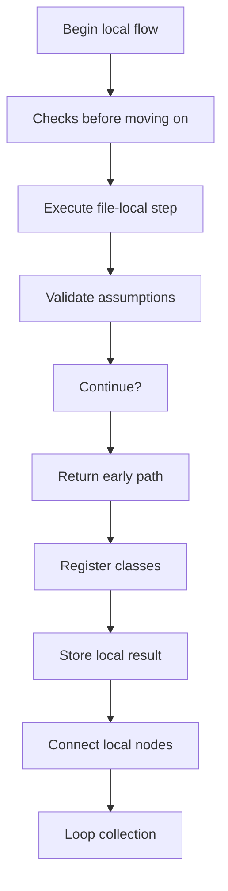
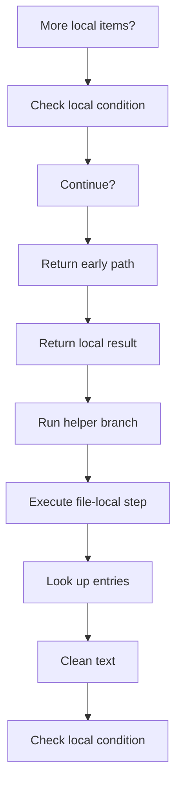
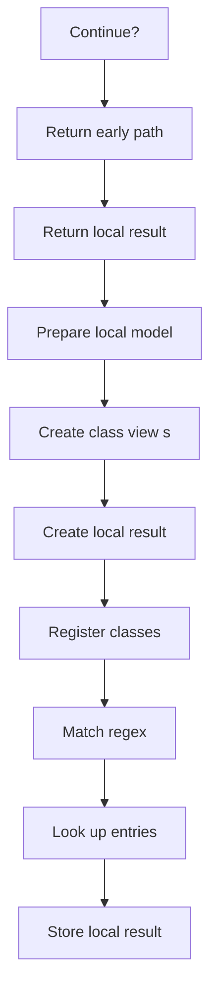
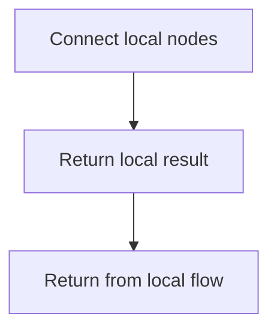
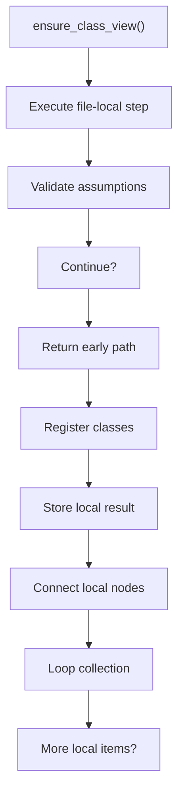
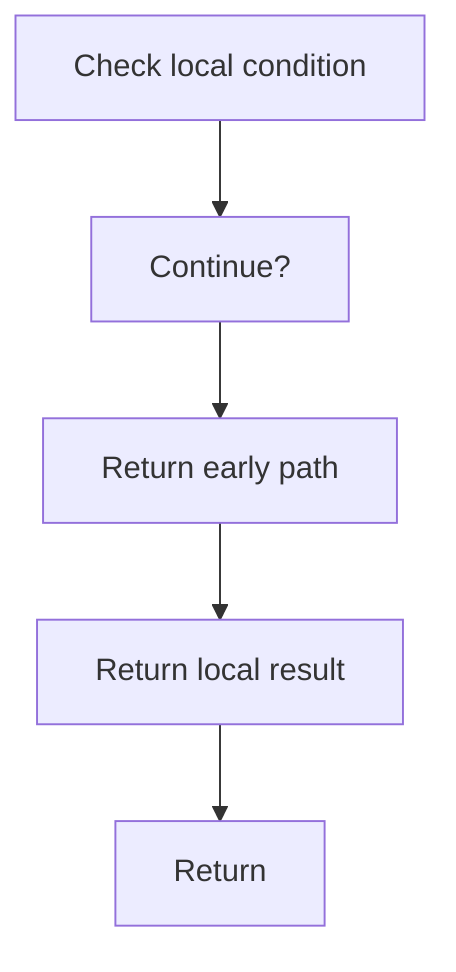
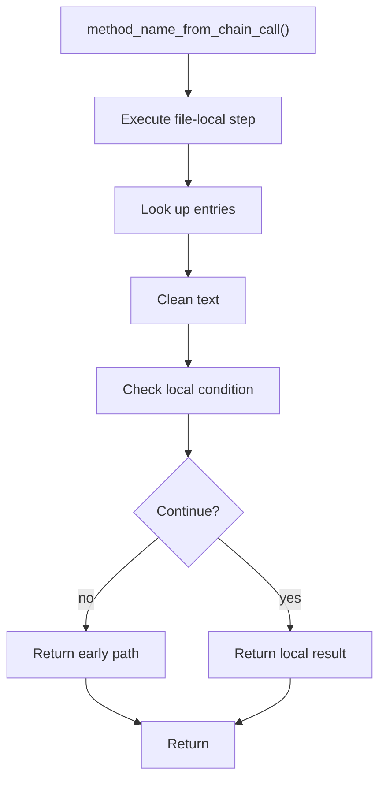
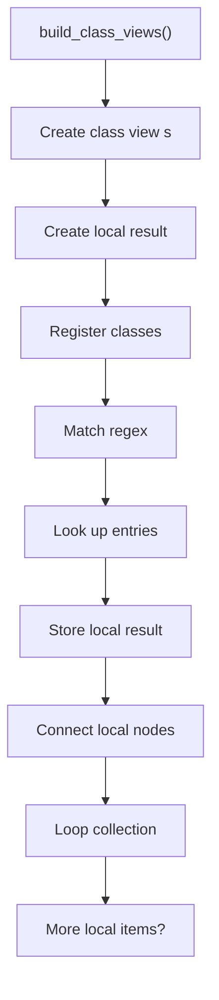

# creational_transform_evidence_model.cpp

- Source: Microservice/Modules/Source/Creational/Transform/creational_transform_evidence_model.cpp
- Kind: C++ implementation

## Story
### What Happens Here

This source file belongs to the older creational transform support path. It is useful for understanding previous rewrite behavior, but the current analyzer runtime focuses on tagging evidence instead of generating replacement code. This source file implements creational-pattern analysis over the generic parse tree. It inspects parsed structure, applies pattern-specific rules, and emits detector results that later appear in the creational tree or documentation tags.

### Why It Matters In The Flow

Runs after the generic parse tree exists so creational detection can label the structure.

### What To Watch While Reading

Implements creational transform dispatch, evidence rendering, and rewrite helpers. The main surface area is easiest to track through symbols such as ensure_class_view, method_name_from_chain_call, build_class_views, and accessor_regex. It collaborates directly with internal/creational_transform_evidence_internal.hpp, regex, unordered_set, and utility.

## Program Flow
This diagram follows the action path in plain words. Decision diamonds show where the file can stop, branch, or repeat work instead of simply passing through a straight line.

The flow is intentionally split into smaller slices so the major intent of creational_transform_evidence_model.cpp stays readable. Each slice names the stage it is covering, gives a quick summary, and explains why that stage is separated from the next one.

### Program Flow Slices
#### Slice 1 - Establish Local Entry
Quick summary: This slice shows the first file-local stage for creational_transform_evidence_model.cpp and keeps the diagram scoped to this code unit.
Why this is separate: creational_transform_evidence_model.cpp has multiple branches, loops, or stage changes, so this section is split out to keep one major intent visible at a time instead of forcing one oversized diagram.

#### Slice 2 - Handle Early Decisions
Quick summary: This slice shows the first local decision path for creational_transform_evidence_model.cpp after setup.
Why this is separate: creational_transform_evidence_model.cpp has multiple branches, loops, or stage changes, so this section is split out to keep one major intent visible at a time instead of forcing one oversized diagram.

#### Slice 3 - Hand Off Local State
Quick summary: This slice shows how creational_transform_evidence_model.cpp passes prepared local state into its next operation.
Why this is separate: creational_transform_evidence_model.cpp has multiple branches, loops, or stage changes, so this section is split out to keep one major intent visible at a time instead of forcing one oversized diagram.

#### Slice 4 - Resolve Secondary Branch
Quick summary: This slice shows the next local decision path in creational_transform_evidence_model.cpp and its immediate result.
Why this is separate: creational_transform_evidence_model.cpp has multiple branches, loops, or stage changes, so this section is split out to keep one major intent visible at a time instead of forcing one oversized diagram.

## Reading Map
Read this file as: Implements creational transform dispatch, evidence rendering, and rewrite helpers.

Where it sits in the run: Runs after the generic parse tree exists so creational detection can label the structure.

Names worth recognizing while reading: ensure_class_view, method_name_from_chain_call, build_class_views, accessor_regex, static_decl_regex, and return_regex.

It leans on nearby contracts or tools such as internal/creational_transform_evidence_internal.hpp, regex, unordered_set, and utility.

## Story Groups

### Checks Before Moving On
These steps stop bad input or unsupported state before it can confuse the next part of the run.
- ensure_class_view(): Validate assumptions before continuing, inspect or register class-level information, and store local findings

### Building The Working Picture
These steps assemble the trees, models, or bundles used by the rest of the file.
- build_class_views(): Create the local output structure, inspect or register class-level information, and match source text with regular expressions

### Supporting Steps
These steps support the local behavior of the file.
- method_name_from_chain_call(): look up local indexes, normalize raw text before later parsing, and branch on local conditions

## Function Stories

### ensure_class_view()
This routine owns one focused piece of the file's behavior.

Inside the body, it mainly handles validate assumptions before continuing, inspect or register class-level information, store local findings, and connect local structures.

The implementation iterates over a collection or repeated workload. It branches on runtime conditions instead of following one fixed path. The caller receives a computed result or status from this step.

What it does:
- validate assumptions before continuing
- inspect or register class-level information
- store local findings
- connect local structures
- walk the local collection
- branch on local conditions

Flow:

### Block 2 - ensure_class_view() Details
#### Slice 1 - Establish Local Entry
Quick summary: This slice shows the first file-local stage for creational_transform_evidence_model.cpp and keeps the diagram scoped to this code unit.
Why this is separate: creational_transform_evidence_model.cpp has multiple branches, loops, or stage changes, so this section is split out to keep one major intent visible at a time instead of forcing one oversized diagram.

#### Slice 2 - Handle Early Decisions
Quick summary: This slice shows the first local decision path for creational_transform_evidence_model.cpp after setup.
Why this is separate: creational_transform_evidence_model.cpp has multiple branches, loops, or stage changes, so this section is split out to keep one major intent visible at a time instead of forcing one oversized diagram.

### method_name_from_chain_call()
This routine owns one focused piece of the file's behavior.

Inside the body, it mainly handles look up local indexes, normalize raw text before later parsing, and branch on local conditions.

It branches on runtime conditions instead of following one fixed path. The caller receives a computed result or status from this step.

What it does:
- look up local indexes
- normalize raw text before later parsing
- branch on local conditions

Flow:

### build_class_views()
This routine assembles a larger structure from the inputs it receives.

Inside the body, it mainly handles Create the local output structure, inspect or register class-level information, match source text with regular expressions, and look up local indexes.

The implementation iterates over a collection or repeated workload. It branches on runtime conditions instead of following one fixed path. The caller receives a computed result or status from this step.

What it does:
- Create the local output structure
- inspect or register class-level information
- match source text with regular expressions
- look up local indexes
- store local findings
- connect local structures
- walk the local collection
- branch on local conditions

Flow:

### Block 3 - build_class_views() Details
#### Slice 1 - Establish Local Entry
Quick summary: This slice shows the first file-local stage for creational_transform_evidence_model.cpp and keeps the diagram scoped to this code unit.
Why this is separate: creational_transform_evidence_model.cpp has multiple branches, loops, or stage changes, so this section is split out to keep one major intent visible at a time instead of forcing one oversized diagram.

#### Slice 2 - Handle Early Decisions
Quick summary: This slice shows the first local decision path for creational_transform_evidence_model.cpp after setup.
Why this is separate: creational_transform_evidence_model.cpp has multiple branches, loops, or stage changes, so this section is split out to keep one major intent visible at a time instead of forcing one oversized diagram.

## Documentation Note
- This markdown file is part of the generated docs/Codebase mirror.
- It was generated from the repository state on 2026-04-23 after reading the existing docs corpus and the current source tree.

