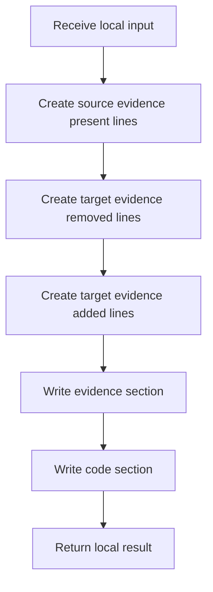

# creational_transform_evidence_render.cpp

- Source: Microservice/Modules/Source/Creational/Transform/creational_transform_evidence_render.cpp
- Kind: C++ implementation

## Story
### What Happens Here

This source file belongs to the older creational transform support path. It is useful for understanding previous rewrite behavior, but the current analyzer runtime focuses on tagging evidence instead of generating replacement code. This source file implements creational-pattern analysis over the generic parse tree. It inspects parsed structure, applies pattern-specific rules, and emits detector results that later appear in the creational tree or documentation tags.

### Why It Matters In The Flow

Runs after the generic parse tree exists so creational detection can label the structure.

### What To Watch While Reading

Implements creational transform dispatch, evidence rendering, and rewrite helpers. The main surface area is easiest to track through symbols such as build_source_evidence_present_lines, static_decl_regex, build_target_evidence_removed_lines, and build_target_evidence_added_lines. It collaborates directly with internal/creational_transform_evidence_internal.hpp, regex, and sstream.

## Program Flow
Quick summary: this diagram shows the file-local activity path for this implementation unit. It stays inside this code file and uses only entry and return boundaries as external references.

Why this slice is separate: deeper helper docs can explain individual functions, while this file still needs to show the main activity path in place.

Detailed program flow is decoupled into future implementation units:

- [program_flow](./RenderFlow/creational_transform_evidence_render_program_flow.cpp.md)
## Reading Map
Read this file as: Implements creational transform dispatch, evidence rendering, and rewrite helpers.

Where it sits in the run: Runs after the generic parse tree exists so creational detection can label the structure.

Names worth recognizing while reading: build_source_evidence_present_lines, static_decl_regex, build_target_evidence_removed_lines, build_target_evidence_added_lines, append_evidence_section, and append_code_section.

It leans on nearby contracts or tools such as internal/creational_transform_evidence_internal.hpp, regex, and sstream.

## Story Groups

### Building The Working Picture
These steps assemble the trees, models, or bundles used by the rest of the file.
- build_source_evidence_present_lines(): Create the local output structure, work one source line at a time, and match source text with regular expressions
- build_target_evidence_removed_lines(): Create the local output structure, work one source line at a time, and match source text with regular expressions
- build_target_evidence_added_lines(): Create the local output structure, work one source line at a time, and connect local structures
- append_evidence_section(): walk the local collection and branch on local conditions
- append_code_section(): walk the local collection

## Function Stories
Function-level logic is decoupled into future implementation units:

- [build_source_evidence_present_lines](./RenderFlow/functions/build_source_evidence_present_lines.cpp.md)
- [build_target_evidence_removed_lines](./RenderFlow/functions/build_target_evidence_removed_lines.cpp.md)
- [build_target_evidence_added_lines](./RenderFlow/functions/build_target_evidence_added_lines.cpp.md)
- [append_evidence_section](./RenderFlow/functions/append_evidence_section.cpp.md)
- [append_code_section](./RenderFlow/functions/append_code_section.cpp.md)
## Documentation Note
- This markdown file is part of the generated docs/Codebase mirror.
- It was generated from the repository state on 2026-04-23 after reading the existing docs corpus and the current source tree.