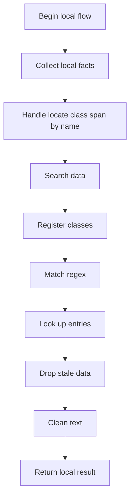
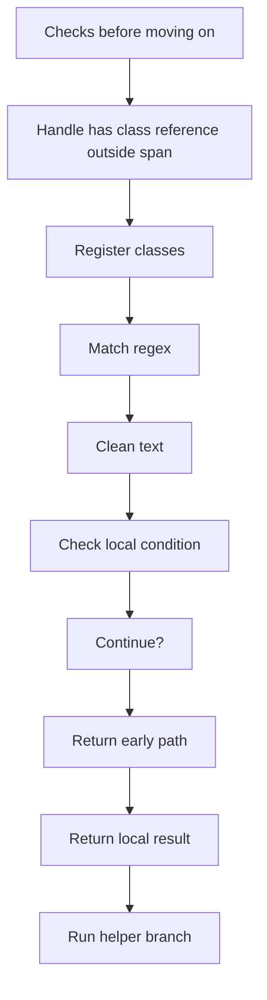
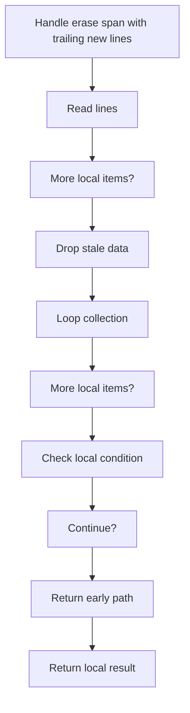
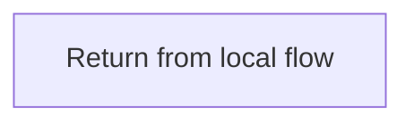
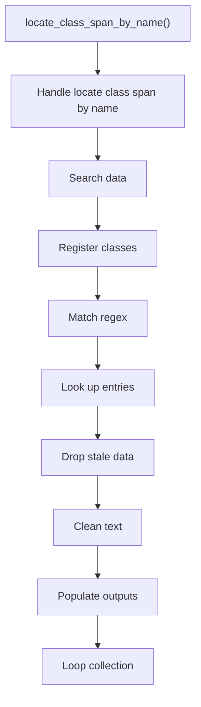
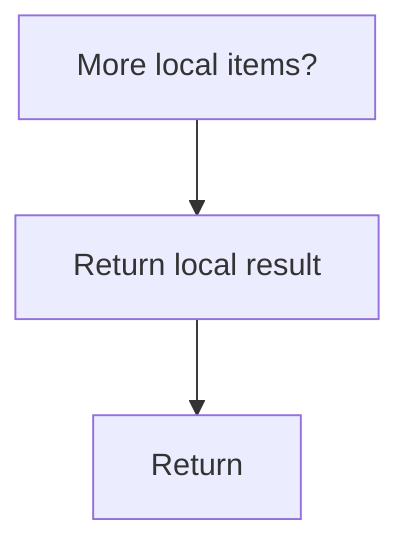
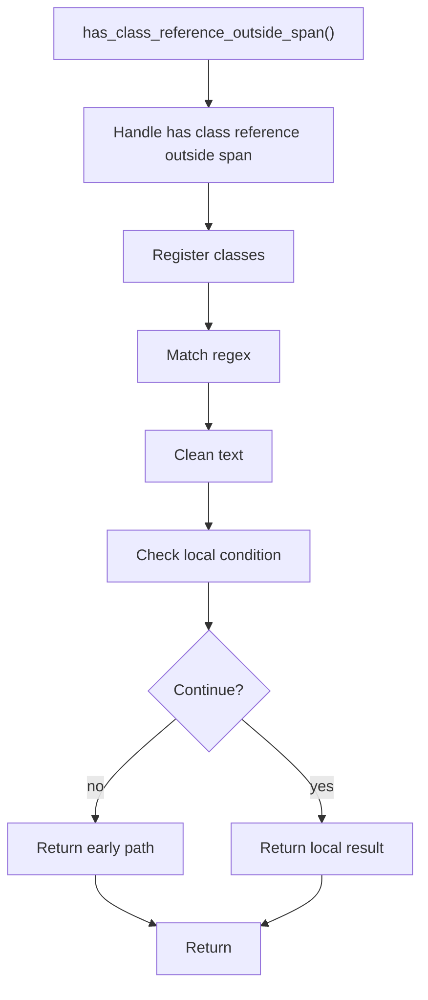
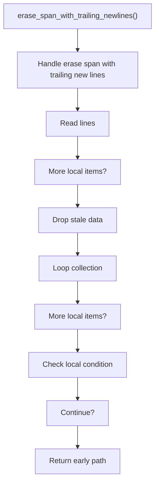
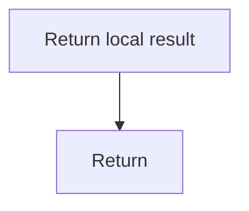

# creational_transform_factory_reverse_cleanup.cpp

- Source: Microservice/Modules/Source/Creational/Transform/creational_transform_factory_reverse_cleanup.cpp
- Kind: C++ implementation

## Story
### What Happens Here

This source file belongs to the older creational transform support path. It is useful for understanding previous rewrite behavior, but the current analyzer runtime focuses on tagging evidence instead of generating replacement code. This source file implements creational-pattern analysis over the generic parse tree. It inspects parsed structure, applies pattern-specific rules, and emits detector results that later appear in the creational tree or documentation tags.

### Why It Matters In The Flow

Runs after the generic parse tree exists so creational detection can label the structure.

### What To Watch While Reading

Implements creational transform dispatch, evidence rendering, and rewrite helpers. The main surface area is easiest to track through symbols such as locate_class_span_by_name, class_regex, has_class_reference_outside_span, and reference_regex. It collaborates directly with internal/creational_transform_factory_reverse_internal.hpp, Transform/creational_code_generator_internal.hpp, regex, and string.

## Program Flow
This diagram follows the action path in plain words. Decision diamonds show where the file can stop, branch, or repeat work instead of simply passing through a straight line.

The flow is intentionally split into smaller slices so the major intent of creational_transform_factory_reverse_cleanup.cpp stays readable. Each slice names the stage it is covering, gives a quick summary, and explains why that stage is separated from the next one.

### Program Flow Slices
#### Slice 1 - Establish Local Entry
Quick summary: This slice shows the first file-local stage for creational_transform_factory_reverse_cleanup.cpp and keeps the diagram scoped to this code unit.
Why this is separate: creational_transform_factory_reverse_cleanup.cpp has multiple branches, loops, or stage changes, so this section is split out to keep one major intent visible at a time instead of forcing one oversized diagram.

#### Slice 2 - Handle Early Decisions
Quick summary: This slice shows the first local decision path for creational_transform_factory_reverse_cleanup.cpp after setup.
Why this is separate: creational_transform_factory_reverse_cleanup.cpp has multiple branches, loops, or stage changes, so this section is split out to keep one major intent visible at a time instead of forcing one oversized diagram.

#### Slice 3 - Hand Off Local State
Quick summary: This slice shows how creational_transform_factory_reverse_cleanup.cpp passes prepared local state into its next operation.
Why this is separate: creational_transform_factory_reverse_cleanup.cpp has multiple branches, loops, or stage changes, so this section is split out to keep one major intent visible at a time instead of forcing one oversized diagram.

#### Slice 4 - Resolve Secondary Branch
Quick summary: This slice shows the next local decision path in creational_transform_factory_reverse_cleanup.cpp and its immediate result.
Why this is separate: creational_transform_factory_reverse_cleanup.cpp has multiple branches, loops, or stage changes, so this section is split out to keep one major intent visible at a time instead of forcing one oversized diagram.

## Reading Map
Read this file as: Implements creational transform dispatch, evidence rendering, and rewrite helpers.

Where it sits in the run: Runs after the generic parse tree exists so creational detection can label the structure.

Names worth recognizing while reading: locate_class_span_by_name, class_regex, has_class_reference_outside_span, reference_regex, std::regex_search, and erase_span_with_trailing_newlines.

It leans on nearby contracts or tools such as internal/creational_transform_factory_reverse_internal.hpp, Transform/creational_code_generator_internal.hpp, regex, and string.

## Story Groups

### Checks Before Moving On
These steps stop bad input or unsupported state before it can confuse the next part of the run.
- has_class_reference_outside_span(): Inspect or register class-level information, match source text with regular expressions, and normalize raw text before later parsing

### Finding What Matters
These steps pick out the facts, traces, and relationships that later stages need.
- locate_class_span_by_name(): Search previously collected data, inspect or register class-level information, and match source text with regular expressions

### Supporting Steps
These steps support the local behavior of the file.
- erase_span_with_trailing_newlines(): Work one source line at a time, drop stale entries or obsolete source fragments, and walk the local collection

## Function Stories

### locate_class_span_by_name()
This routine owns one focused piece of the file's behavior.

Inside the body, it mainly handles search previously collected data, inspect or register class-level information, match source text with regular expressions, and look up local indexes.

The implementation iterates over a collection or repeated workload. It branches on runtime conditions instead of following one fixed path. The caller receives a computed result or status from this step.

What it does:
- search previously collected data
- inspect or register class-level information
- match source text with regular expressions
- look up local indexes
- drop stale entries or obsolete source fragments
- normalize raw text before later parsing
- fill local output fields
- walk the local collection
- branch on local conditions

Flow:

### Block 2 - locate_class_span_by_name() Details
#### Slice 1 - Establish Local Entry
Quick summary: This slice shows the first file-local stage for creational_transform_factory_reverse_cleanup.cpp and keeps the diagram scoped to this code unit.
Why this is separate: creational_transform_factory_reverse_cleanup.cpp has multiple branches, loops, or stage changes, so this section is split out to keep one major intent visible at a time instead of forcing one oversized diagram.

#### Slice 2 - Handle Early Decisions
Quick summary: This slice shows the first local decision path for creational_transform_factory_reverse_cleanup.cpp after setup.
Why this is separate: creational_transform_factory_reverse_cleanup.cpp has multiple branches, loops, or stage changes, so this section is split out to keep one major intent visible at a time instead of forcing one oversized diagram.

### has_class_reference_outside_span()
This routine owns one focused piece of the file's behavior.

Inside the body, it mainly handles inspect or register class-level information, match source text with regular expressions, normalize raw text before later parsing, and branch on local conditions.

It branches on runtime conditions instead of following one fixed path. The caller receives a computed result or status from this step.

What it does:
- inspect or register class-level information
- match source text with regular expressions
- normalize raw text before later parsing
- branch on local conditions

Flow:

### erase_span_with_trailing_newlines()
This routine owns one focused piece of the file's behavior.

Inside the body, it mainly handles work one source line at a time, drop stale entries or obsolete source fragments, walk the local collection, and branch on local conditions.

The implementation iterates over a collection or repeated workload. It branches on runtime conditions instead of following one fixed path. The caller receives a computed result or status from this step.

What it does:
- work one source line at a time
- drop stale entries or obsolete source fragments
- walk the local collection
- branch on local conditions

Flow:

### Block 3 - erase_span_with_trailing_newlines() Details
#### Slice 1 - Establish Local Entry
Quick summary: This slice shows the first file-local stage for creational_transform_factory_reverse_cleanup.cpp and keeps the diagram scoped to this code unit.
Why this is separate: creational_transform_factory_reverse_cleanup.cpp has multiple branches, loops, or stage changes, so this section is split out to keep one major intent visible at a time instead of forcing one oversized diagram.

#### Slice 2 - Handle Early Decisions
Quick summary: This slice shows the first local decision path for creational_transform_factory_reverse_cleanup.cpp after setup.
Why this is separate: creational_transform_factory_reverse_cleanup.cpp has multiple branches, loops, or stage changes, so this section is split out to keep one major intent visible at a time instead of forcing one oversized diagram.

## Documentation Note
- This markdown file is part of the generated docs/Codebase mirror.
- It was generated from the repository state on 2026-04-23 after reading the existing docs corpus and the current source tree.

