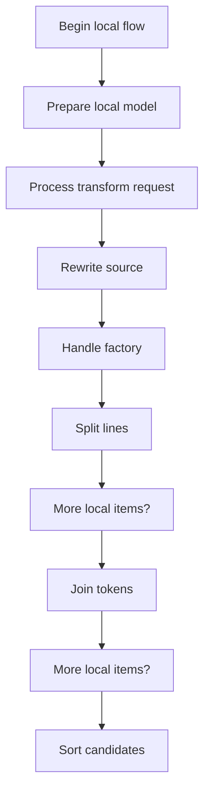
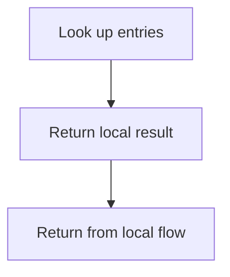
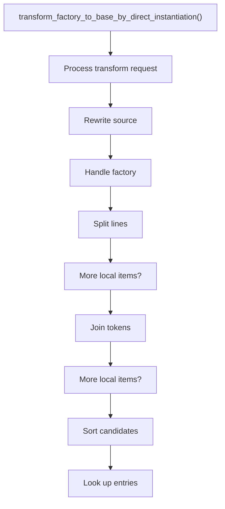
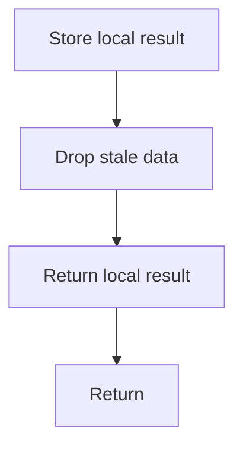

# creational_transform_factory_reverse.cpp

- Source: Microservice/Modules/Source/Creational/Transform/creational_transform_factory_reverse.cpp
- Kind: C++ implementation

## Story
### What Happens Here

This source file belongs to the older creational transform support path. It is useful for understanding previous rewrite behavior, but the current analyzer runtime focuses on tagging evidence instead of generating replacement code. This source file implements creational-pattern analysis over the generic parse tree. It inspects parsed structure, applies pattern-specific rules, and emits detector results that later appear in the creational tree or documentation tags.

### Why It Matters In The Flow

Runs after the generic parse tree exists so creational detection can label the structure.

### What To Watch While Reading

Implements creational transform dispatch, evidence rendering, and rewrite helpers. The main surface area is easiest to track through symbols such as transform_factory_to_base_by_direct_instantiation. It collaborates directly with Transform/creational_transform_factory_reverse.hpp, Transform/creational_code_generator_internal.hpp, internal/creational_transform_factory_reverse_internal.hpp, and algorithm.

## Program Flow
This diagram follows the action path in plain words. Decision diamonds show where the file can stop, branch, or repeat work instead of simply passing through a straight line.

The flow is intentionally split into smaller slices so the major intent of creational_transform_factory_reverse.cpp stays readable. Each slice names the stage it is covering, gives a quick summary, and explains why that stage is separated from the next one.

### Program Flow Slices
#### Slice 1 - Establish Local Entry
Quick summary: This slice shows the first file-local stage for creational_transform_factory_reverse.cpp and keeps the diagram scoped to this code unit.
Why this is separate: creational_transform_factory_reverse.cpp has multiple branches, loops, or stage changes, so this section is split out to keep one major intent visible at a time instead of forcing one oversized diagram.

#### Slice 2 - Handle Early Decisions
Quick summary: This slice shows the first local decision path for creational_transform_factory_reverse.cpp after setup.
Why this is separate: creational_transform_factory_reverse.cpp has multiple branches, loops, or stage changes, so this section is split out to keep one major intent visible at a time instead of forcing one oversized diagram.

## Reading Map
Read this file as: Implements creational transform dispatch, evidence rendering, and rewrite helpers.

Where it sits in the run: Runs after the generic parse tree exists so creational detection can label the structure.

Names worth recognizing while reading: transform_factory_to_base_by_direct_instantiation.

It leans on nearby contracts or tools such as Transform/creational_transform_factory_reverse.hpp, Transform/creational_code_generator_internal.hpp, internal/creational_transform_factory_reverse_internal.hpp, algorithm, string, and unordered_map.

## Story Groups

### Building The Working Picture
These steps assemble the trees, models, or bundles used by the rest of the file.
- transform_factory_to_base_by_direct_instantiation(): Rewrite source text or model state, handle factory-specific detection or rewrite logic, and split the source into individual lines

## Function Stories

### transform_factory_to_base_by_direct_instantiation()
This routine owns one focused piece of the file's behavior.

Inside the body, it mainly handles rewrite source text or model state, handle factory-specific detection or rewrite logic, split the source into individual lines, and reassemble token or line collections into text.

The implementation iterates over a collection or repeated workload. It branches on runtime conditions instead of following one fixed path. The caller receives a computed result or status from this step.

What it does:
- rewrite source text or model state
- handle factory-specific detection or rewrite logic
- split the source into individual lines
- reassemble token or line collections into text
- order candidate values before selecting or emitting them
- look up local indexes
- store local findings
- drop stale entries or obsolete source fragments
- normalize raw text before later parsing
- fill local output fields
- read local tokens
- connect local structures
- compute hash metadata
- walk the local collection
- branch on local conditions

Flow:

### Block 2 - transform_factory_to_base_by_direct_instantiation() Details
#### Slice 1 - Establish Local Entry
Quick summary: This slice shows the first file-local stage for creational_transform_factory_reverse.cpp and keeps the diagram scoped to this code unit.
Why this is separate: creational_transform_factory_reverse.cpp has multiple branches, loops, or stage changes, so this section is split out to keep one major intent visible at a time instead of forcing one oversized diagram.

#### Slice 2 - Handle Early Decisions
Quick summary: This slice shows the first local decision path for creational_transform_factory_reverse.cpp after setup.
Why this is separate: creational_transform_factory_reverse.cpp has multiple branches, loops, or stage changes, so this section is split out to keep one major intent visible at a time instead of forcing one oversized diagram.

## Documentation Note
- This markdown file is part of the generated docs/Codebase mirror.
- It was generated from the repository state on 2026-04-23 after reading the existing docs corpus and the current source tree.

