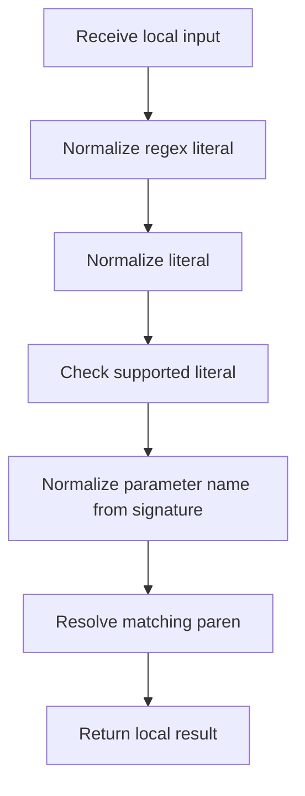

# creational_transform_factory_reverse_parse_literals.cpp

- Source: Microservice/Modules/Source/Creational/Transform/creational_transform_factory_reverse_parse_literals.cpp
- Kind: C++ implementation

## Story
### What Happens Here

This source file belongs to the older creational transform support path. It is useful for understanding previous rewrite behavior, but the current analyzer runtime focuses on tagging evidence instead of generating replacement code. This source file implements creational-pattern analysis over the generic parse tree. It inspects parsed structure, applies pattern-specific rules, and emits detector results that later appear in the creational tree or documentation tags.

### Why It Matters In The Flow

Runs after the generic parse tree exists so creational detection can label the structure.

### What To Watch While Reading

Implements creational transform dispatch, evidence rendering, and rewrite helpers. The main surface area is easiest to track through symbols such as escape_regex_literal, find_matching_paren, is_supported_literal, and normalize_literal. It collaborates directly with internal/creational_transform_factory_reverse_internal.hpp, Transform/creational_code_generator_internal.hpp, cctype, and iomanip.

## Program Flow
Quick summary: this diagram shows the file-local activity path for this implementation unit. It stays inside this code file and uses only entry and return boundaries as external references.

Why this slice is separate: deeper helper docs can explain individual functions, while this file still needs to show the main activity path in place.

Detailed program flow is decoupled into future implementation units:

- [program_flow_01](./ParseLiteralsFlow/creational_transform_factory_reverse_parse_literals_program_flow_01.cpp.md)
- [program_flow_02](./ParseLiteralsFlow/creational_transform_factory_reverse_parse_literals_program_flow_02.cpp.md)
## Reading Map
Read this file as: Implements creational transform dispatch, evidence rendering, and rewrite helpers.

Where it sits in the run: Runs after the generic parse tree exists so creational detection can label the structure.

Names worth recognizing while reading: escape_regex_literal, find_matching_paren, is_supported_literal, normalize_literal, trim, and collapse_ascii_whitespace.

It leans on nearby contracts or tools such as internal/creational_transform_factory_reverse_internal.hpp, Transform/creational_code_generator_internal.hpp, cctype, iomanip, regex, and sstream.

## Story Groups

### Small Preparation Steps
These steps clean up names, text, or small values before the larger work begins.
- escape_regex_literal(): Normalize or format text values, store local findings, and connect local structures
- normalize_literal(): Normalize or format text values and normalize raw text before later parsing

### Checks Before Moving On
These steps stop bad input or unsupported state before it can confuse the next part of the run.
- is_supported_literal(): Normalize raw text before later parsing, walk the local collection, and branch on local conditions

### Reading The Input
These steps turn raw text or arguments into something the program can follow.
- parse_parameter_name_from_signature(): Parse source text into structured values, look up local indexes, and normalize raw text before later parsing

### Finding What Matters
These steps pick out the facts, traces, and relationships that later stages need.
- find_matching_paren(): Search previously collected data, walk the local collection, and branch on local conditions

### Building The Working Picture
These steps assemble the trees, models, or bundles used by the rest of the file.
- collapse_ascii_whitespace(): store local findings, normalize raw text before later parsing, and fill local output fields
- build_hash_ledger_entry(): Create the local output structure, compute or reuse hash-oriented identifiers, and normalize raw text before later parsing

### Supporting Steps
These steps support the local behavior of the file.
- make_vital_part_hash_id(): Compute or reuse hash-oriented identifiers and compute hash metadata
- make_fnv1a64_hash_id(): Compute or reuse hash-oriented identifiers, fill local output fields, and compute hash metadata
- first_return_expression(): Match source text with regular expressions, normalize raw text before later parsing, and branch on local conditions
- literal_from_condition(): Match source text with regular expressions, fill local output fields, and branch on local conditions
- statement_after_condition(): look up local indexes, normalize raw text before later parsing, and fill local output fields

## Function Stories
Function-level logic is decoupled into future implementation units:

- [escape_regex_literal](./ParseLiteralsFlow/functions/escape_regex_literal.cpp.md)
- [find_matching_paren](./ParseLiteralsFlow/functions/find_matching_paren.cpp.md)
- [is_supported_literal](./ParseLiteralsFlow/functions/is_supported_literal.cpp.md)
- [normalize_literal](./ParseLiteralsFlow/functions/normalize_literal.cpp.md)
- [collapse_ascii_whitespace](./ParseLiteralsFlow/functions/collapse_ascii_whitespace.cpp.md)
- [make_vital_part_hash_id](./ParseLiteralsFlow/functions/make_vital_part_hash_id.cpp.md)
- [make_fnv1a64_hash_id](./ParseLiteralsFlow/functions/make_fnv1a64_hash_id.cpp.md)
- [build_hash_ledger_entry](./ParseLiteralsFlow/functions/build_hash_ledger_entry.cpp.md)
- [first_return_expression](./ParseLiteralsFlow/functions/first_return_expression.cpp.md)
- [parse_parameter_name_from_signature](./ParseLiteralsFlow/functions/parse_parameter_name_from_signature.cpp.md)
- [literal_from_condition](./ParseLiteralsFlow/functions/literal_from_condition.cpp.md)
- [statement_after_condition](./ParseLiteralsFlow/functions/statement_after_condition.cpp.md)
## Documentation Note
- This markdown file is part of the generated docs/Codebase mirror.
- It was generated from the repository state on 2026-04-23 after reading the existing docs corpus and the current source tree.