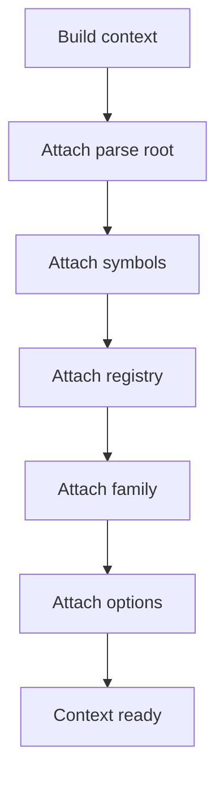
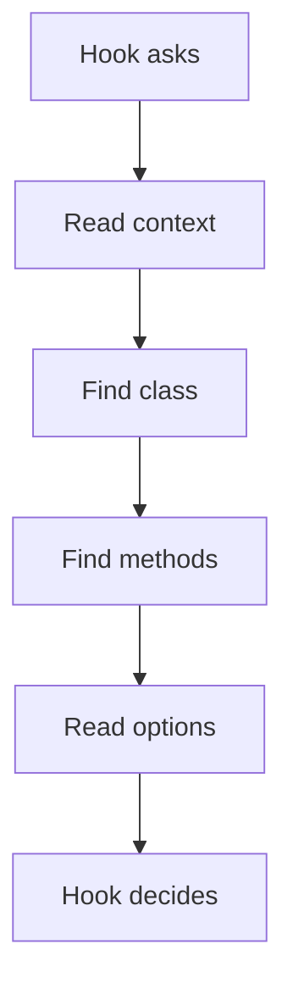

# pattern_context.cpp

## Role
Bundles parse root, symbol tables, registered classes, registered functions, family selection, and options into one object passed to every hook.

## Intended Source Role
This file maps to the future context object. It is the read-only shared state passed into hooks so each hook does not rebuild the same information.

## Context Flow

## Shared Data
- Parse root.
- Symbol tables.
- Class registry.
- Function registry.
- Pattern family.
- Hook options.

## Context Sections
- Request section.
- Registry section.
- Symbol section.
- Family section.
- Option section.
- Diagnostic section.

## Access Flow

## Mutation Rule
Hooks should treat context as read-only. If a hook finds evidence, it returns evidence to the dispatcher. It does not write back into the shared context.
