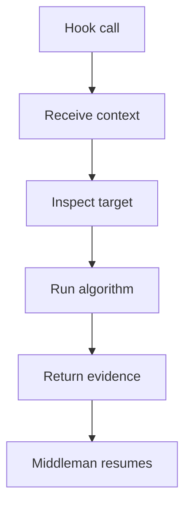
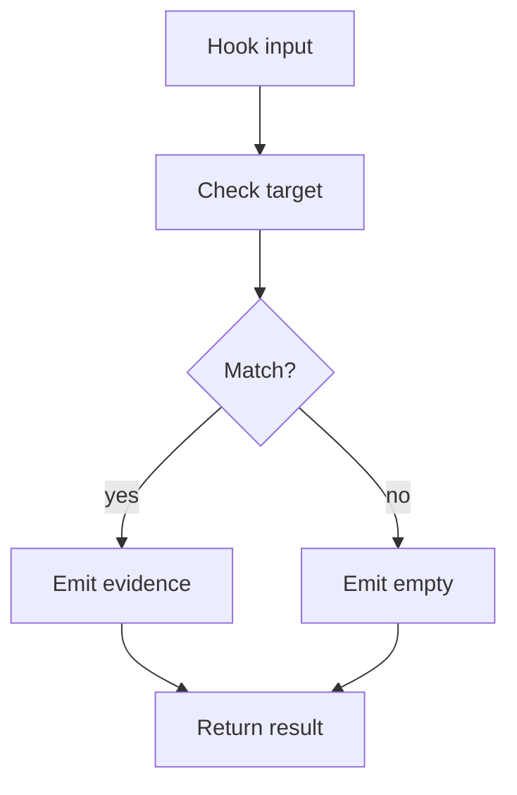

# pattern_hook_contract.cpp

## Role
Defines how pattern-specific algorithms plug into the middleman. The hook may be a virtual function, function pointer, or equivalent callback.

## Intended Source Role
This file maps to the future hook interface. Every Factory, Singleton, Builder, Strategy, Observer, or scaffold detector must fit this same callable shape.

## Hook Contract Flow

## Hook Rules
- Do not register classes.
- Do not register functions.
- Do not create root nodes.
- Do not assemble final trees.
- Do only pattern-specific logic.
- Return empty output when no match exists.

## Hook Inputs
- Shared context.
- Current class record.
- Related function records.
- Pattern options.
- Evidence sink.

## Hook Output
- Match flag.
- Pattern name.
- Target class.
- Related functions.
- Evidence notes.
- Confidence or reason.

## Rejection Flow

