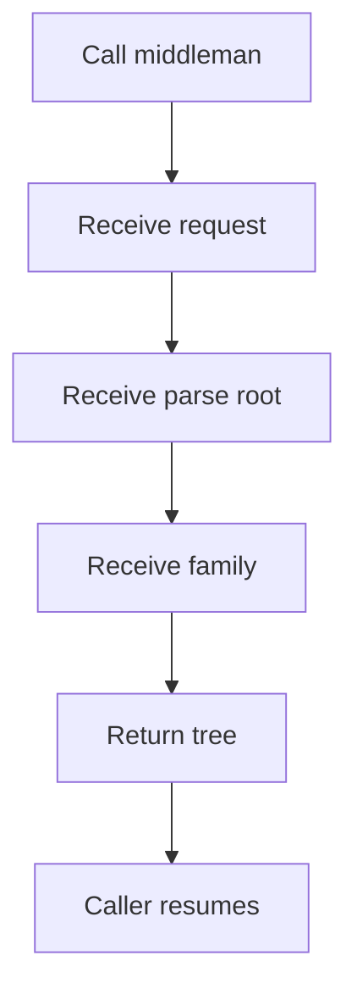
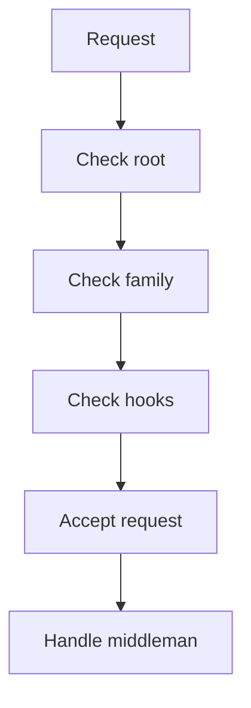

# pattern_middleman_contract.cpp

## Role
Defines the single public entrypoint for pattern tree assembly. This contract is shared by Behavioural and Creational callers.

## Intended Source Role
This file maps to the future public middleman interface. It should expose one request shape and one result shape for every pattern family.

## Contract Flow

## Responsibilities
- Provide one entrypoint.
- Accept Behavioural requests.
- Accept Creational requests.
- Hide shared assembly details.
- Return a finished tree.
- Avoid family-specific middlemen.

## Request Fields
- Parse root pointer.
- Pattern family.
- Pattern list.
- Scan options.
- Output labels.
- Error policy.

## Result Fields
- Root node.
- Matched children.
- Evidence records.
- Empty-result flag.
- Diagnostic messages.

## Validation Flow

