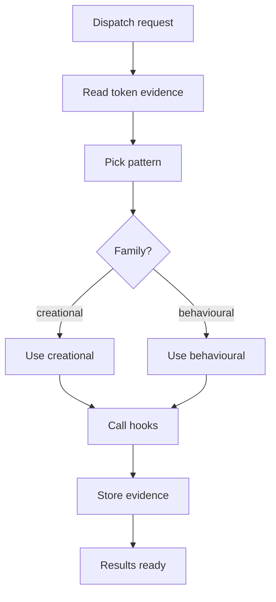
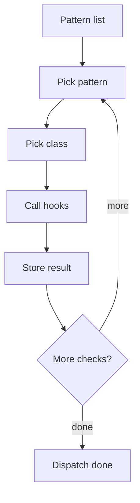
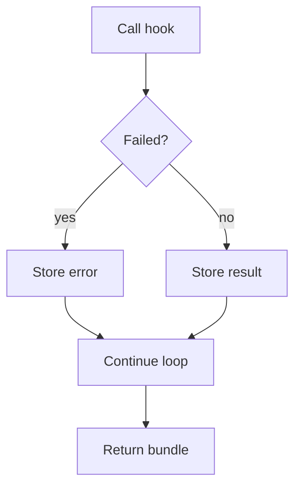

# pattern_hook_dispatcher.cpp

## Role
Iterates enabled catalog definitions and selects Behavioural or Creational hook groups without creating separate middlemen.

## Intended Source Role
This file maps to the future dispatcher. It owns all-pattern iteration, token-sequence evidence routing, hook selection, and hook calls. It does not own tree assembly.

## Dispatch Flow

## Pattern Loop

## Hook Selection
- Creational catalog entries can load Factory, Singleton, and Builder hooks.
- Behavioural catalog entries can load Strategy, Observer, and scaffold hooks.
- New pattern families add hook groups, not new middlemen.
- Disabled hooks are skipped by options.
- Failed hooks return diagnostics without breaking shared setup.
- Default behavior checks all enabled catalog entries against every completed class declaration.
- Token-sequence evidence from `../../Catalog/pattern_token_sequence_matcher.cpp.md` is passed to hooks before family-specific logic runs.

## Error Flow

