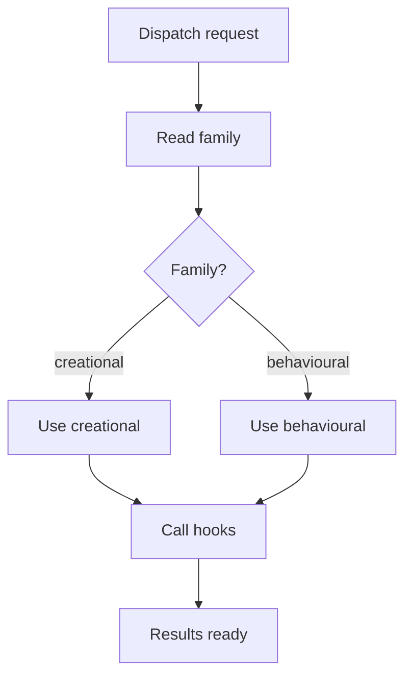
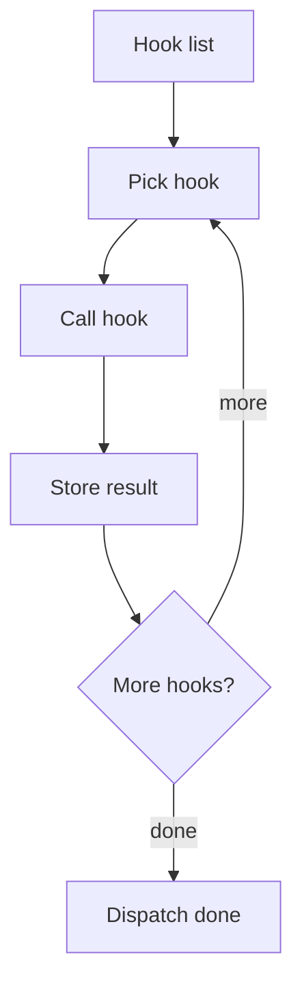
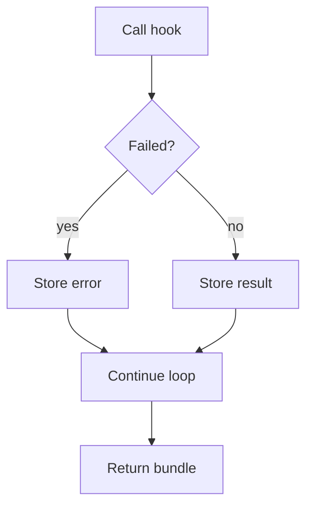

# pattern_hook_dispatcher.cpp

## Role
Selects Behavioural or Creational hook groups without creating separate middlemen.

## Intended Source Role
This file maps to the future dispatcher. It owns hook selection and hook calls. It does not own tree assembly.

## Dispatch Flow

## Hook Loop

## Hook Selection
- Creational request loads Factory, Singleton, and Builder hooks.
- Behavioural request loads Strategy, Observer, and scaffold hooks.
- New pattern families add hook groups, not new middlemen.
- Disabled hooks are skipped by options.
- Failed hooks return diagnostics without breaking shared setup.

## Error Flow

