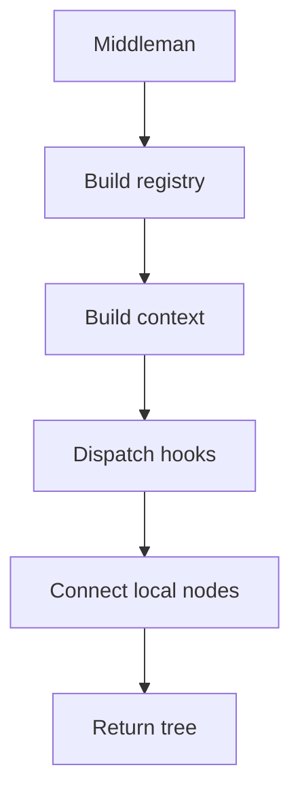

# Middleman

## Purpose
Middleman owns the end-to-end process and delegates only the pattern-specific algorithm to hooks.

## Files As Implementation Units
- `pattern_middleman.cpp.md` represents the one shared orchestration module.
- Behavioural and Creational requests pass through this same file.
- Shared logic overlaps here instead of being copied into separate family paths.

## Folder Flow

