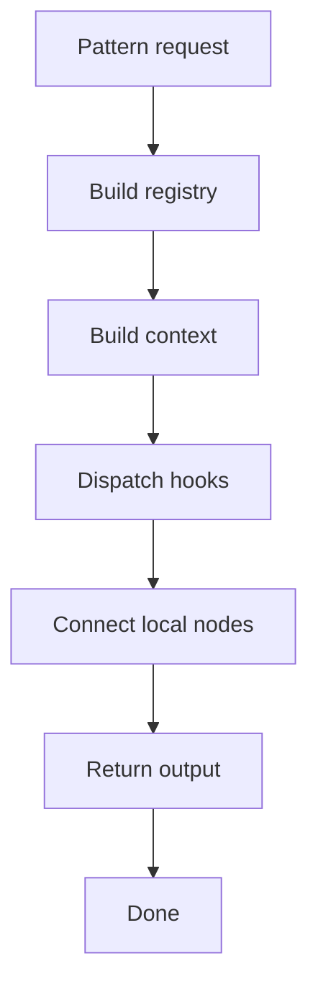
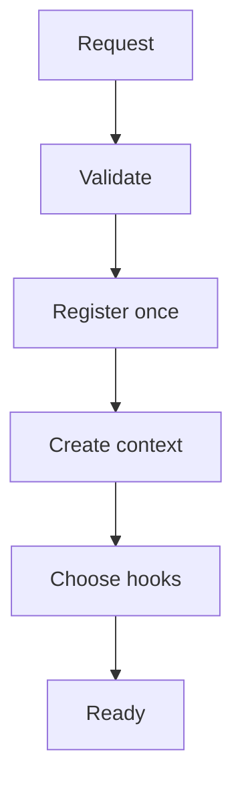
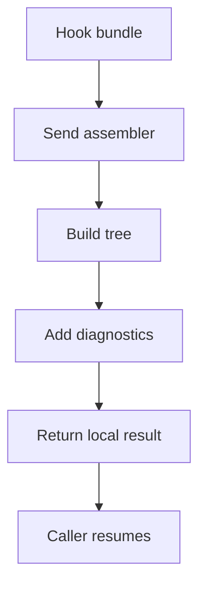

# pattern_middleman.cpp

## Role
Coordinates registry, context, dispatcher, and assembler. This is the one middleman for Behavioural and Creational pattern logic.

## Intended Source Role
This file maps to the future orchestration implementation. It is the only module that knows the complete shared process.

## Orchestration Flow

## Ownership
- Calls registry.
- Calls context builder.
- Calls dispatcher.
- Calls assembler.
- Does not run pattern algorithms directly.
- Does not duplicate Behavioural and Creational paths.

## Detailed Steps
1. Validate the request through the middleman contract.
2. Build one registry from the parse root.
3. Create one context from request and registry data.
4. Ask dispatcher for the correct hook group.
5. Run hooks through the hook contract.
6. Pass hook results to assembler.
7. Return one final tree to the caller.

## Shared Setup Flow

## Output Flow

