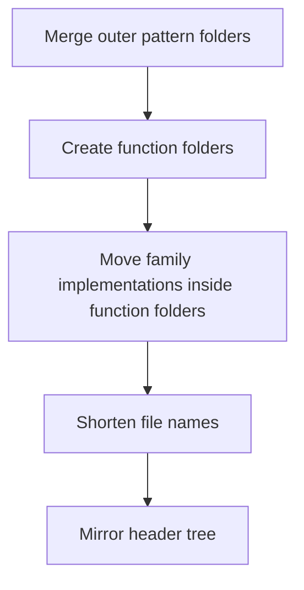

# current_to_middleman.cpp

## Role
Maps the current docs tree to the logic-first pattern structure that matches the readable `SyntacticBrokenAST/` style.

## Current Outer Split
```text
Source/
  Behavioural/
  Creational/
  PatternMiddlemanArchitecture/
```

## Target Outer Split
```text
Source/
  Pattern/
    Contracts/
    Registry/
    Context/
    Dispatcher/
    Assembler/
    Middleman/
    BrokenTree/
      Behavioural/
      Creational/
    SymbolTest/
      Behavioural/
      Creational/
    Hooks/
      Behavioural/
      Creational/
    Transform/
```

## Direct Mapping
- `Source/Behavioural/behavioural_broken_tree.cpp.md` -> `Source/Pattern/BrokenTree/Behavioural/tree.cpp.md`
- `Source/Creational/creational_broken_tree.cpp.md` -> `Source/Pattern/BrokenTree/Creational/tree.cpp.md`
- `Source/Behavioural/behavioural_symbol_test.cpp.md` -> `Source/Pattern/SymbolTest/Behavioural/symbol_test.cpp.md`
- `Source/Creational/creational_symbol_test.cpp.md` -> `Source/Pattern/SymbolTest/Creational/symbol_test.cpp.md`
- `Source/Behavioural/Logic/behavioural_logic_scaffold.cpp.md` -> `Source/Pattern/Hooks/Behavioural/scaffold.cpp.md`
- `Source/Behavioural/Logic/behavioural_structural_hooks.cpp.md` -> `Source/Pattern/Hooks/Behavioural/structure.cpp.md`
- `Source/Creational/Builder/builder_pattern_logic.cpp.md` -> `Source/Pattern/Hooks/Creational/builder.cpp.md`
- `Source/Creational/Factory/factory_pattern_logic.cpp.md` -> `Source/Pattern/Hooks/Creational/factory.cpp.md`
- `Source/Creational/Singleton/singleton_pattern_logic.cpp.md` -> `Source/Pattern/Hooks/Creational/singleton.cpp.md`
- `Source/Creational/Logic/creational_logic_scaffold.cpp.md` -> `Source/Pattern/Hooks/Creational/Common/scaffold.cpp.md`
- `Source/Creational/Logic/creational_structural_hooks.cpp.md` -> `Source/Pattern/Hooks/Creational/Common/structure.cpp.md`
- `Source/Creational/Transform/` -> `Source/Pattern/Transform/`
- `Source/PatternMiddlemanArchitecture/Contracts/` -> `Source/Pattern/Contracts/`
- `Source/PatternMiddlemanArchitecture/Registry/` -> `Source/Pattern/Registry/`
- `Source/PatternMiddlemanArchitecture/Context/` -> `Source/Pattern/Context/`
- `Source/PatternMiddlemanArchitecture/Dispatcher/` -> `Source/Pattern/Dispatcher/`
- `Source/PatternMiddlemanArchitecture/Assembler/` -> `Source/Pattern/Assembler/`
- `Source/PatternMiddlemanArchitecture/Middleman/` -> `Source/Pattern/Middleman/`
- `Source/PatternMiddlemanArchitecture/Hooks/Behavioural/strategy_hook.cpp.md` -> `Source/Pattern/Hooks/Behavioural/strategy.cpp.md`
- `Source/PatternMiddlemanArchitecture/Hooks/Behavioural/observer_hook.cpp.md` -> `Source/Pattern/Hooks/Behavioural/observer.cpp.md`
- `Source/PatternMiddlemanArchitecture/Hooks/Behavioural/scaffold_hook.cpp.md` -> `Source/Pattern/Hooks/Behavioural/scaffold.cpp.md`
- `Source/PatternMiddlemanArchitecture/Hooks/Creational/builder_hook.cpp.md` -> `Source/Pattern/Hooks/Creational/builder.cpp.md`
- `Source/PatternMiddlemanArchitecture/Hooks/Creational/factory_hook.cpp.md` -> `Source/Pattern/Hooks/Creational/factory.cpp.md`
- `Source/PatternMiddlemanArchitecture/Hooks/Creational/singleton_hook.cpp.md` -> `Source/Pattern/Hooks/Creational/singleton.cpp.md`

## Naming Rules
- Function name belongs in the folder before family name.
- Family name belongs in the path before the file name.
- File name should only carry the local implementation role.
- Generic overlap moves into a shared folder instead of staying repeated in file prefixes.

## Refactor Order


## Acceptance Checks
- `Pattern/` becomes the only outer source folder for design-pattern logic.
- `BrokenTree`, `SymbolTest`, `Hooks`, and `Transform` are visible before `Behavioural` or `Creational`.
- Repeated `behavioural_`, `creational_`, and `pattern_` prefixes are removed when the path already carries that meaning.
