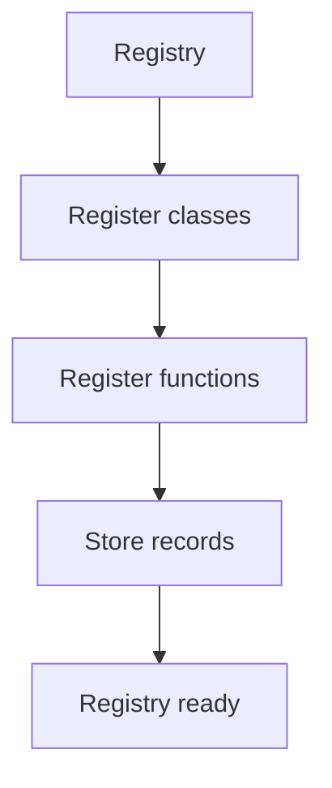

# Registry

## Purpose
Registry owns shared class and function registration for all pattern families.

## Files As Implementation Units
- `pattern_registry.cpp.md` represents the shared registry builder.
- It is called once before hook dispatch.
- It replaces repeated registration inside each design pattern.

## Folder Flow

